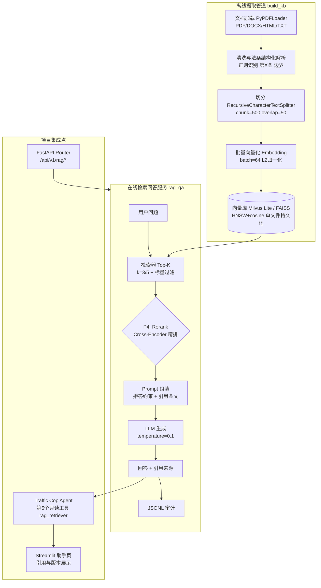
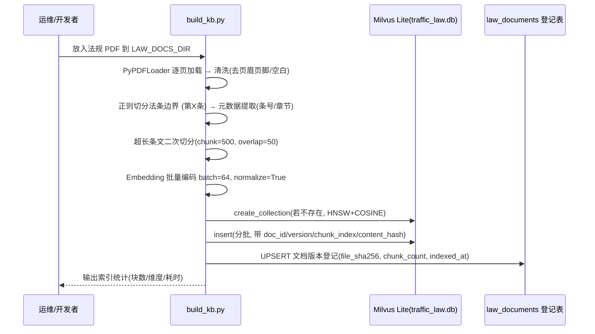
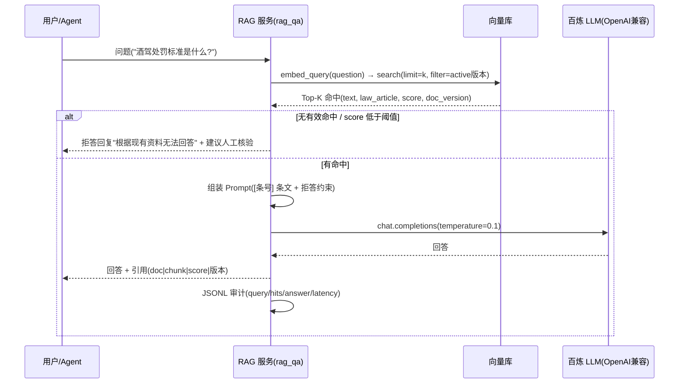
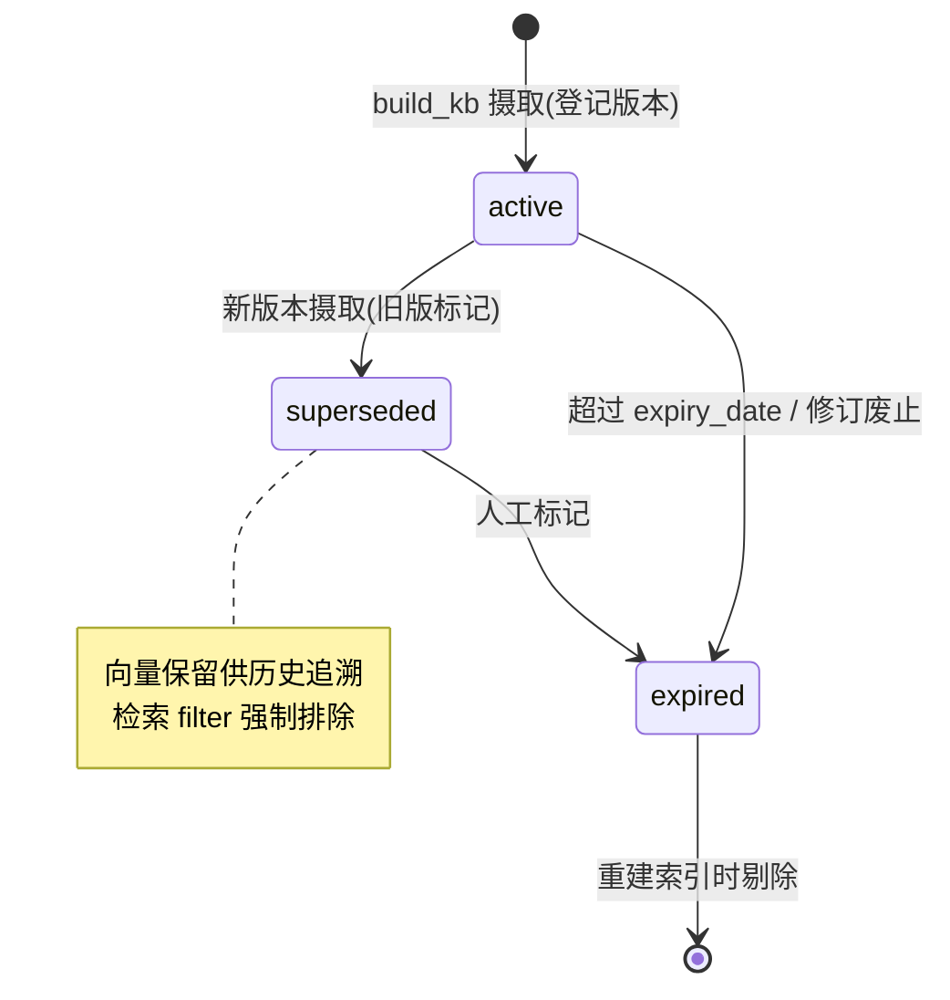

# PROJECT_SPEC.md — 《RAG 知识库：向量检索与交通法规智能问答》系统架构与实施规格说明书

> **版本**：v1.0（2026-09-16）
> **来源资料**：`20260915RAG知识库_向量检索与法规问答.pptx`（13 页，逐页 OOXML 全文提取）+ 同批配套《RAG知识库系统_技术文档.docx》（交叉校验与代码补全来源）
> **适用范围**：`intel-transportation` 智慧交通项目 P3 阶段"Traffic Cop RAG 与应急研判"中的法规知识库子系统（VIBECODING.md §5.3 / §P3）
> **资料边界**：课件中的性能数字（92% 检索准确率、45ms 延迟等）为**教学参考值**，不构成项目验收证据；课件代码存在旧版 API 与不可直接运行的片段，本文逐段标注项目化修订。本规格书描述的是**目标态实施规范**——已于 2026-09-17 按 §6 路线图完成 Step 1-4 的代码落地并通过真实百炼链路端到端验证（Milvus Lite 检索 + 引用 + 拒答），Step 5 中的命中率验收、RAGAS 评估与 BGE 本地路径演练仍未完成；任何能力表述以 VIBECODING.md 状态边界与运行证据为准。

---

## 0. 课件逆向结论摘要

13 页课件的组织结构与关键结论：

| 页 | 主题 | 核心信息 |
|---|------|---------|
| 1–2 | 标题与目录 | 文档切分 · Embedding 向量化 · Milvus/FAISS · 检索增强生成；提交物《RAG知识库系统》 |
| 3 | RAG 原理 | 五步流水线：文档加载 → 文档切分（chunk=500）→ 向量化（768/1536 维）→ 向量存储（Milvus/FAISS）→ 检索增强（Top-K + LLM）；RAG vs 纯 LLM 四项对比 |
| 4 | 文档切分 | `RecursiveCharacterTextSplitter`，chunk_size=500、overlap=50、中文分隔符 |
| 5 | Embedding | OpenAI `text-embedding-3-small/large` 与 BGE 中文系列双通道；`normalize_embeddings=True` |
| 6 | 向量数据库 | Milvus Lite（单文件、pymilvus、标量过滤、可迁移集群）vs FAISS（算法库、纯内存、GPU、无元数据过滤） |
| 7 | 索引构建 | `FAISS.from_documents` / `save_local` / `load_local` / `similarity_search(k=3)`；Flat/IVF/HNSW/PQ 召回率-速度对比 |
| 8 | 法规知识库实战 | 五步实战流程 + `RetrievalQA`（stuff、`return_source_documents=True`、k=3） |
| 9 | 问答示例 | 酒驾（第91条）、超速（第42条）样例；引用格式 `doc | chunk | score`；教学评估指标 |
| 10 | 高级 RAG | 查询重写 → 混合检索 → Rerank 精排 → 上下文压缩 → LLM 生成（可组合） |
| 11 | 提交物 | build_kb.py、rag_qa.py、faiss_index/（index.faiss + index.pkl）、README/requirements/法规样本 |
| 12 | 验收标准 | 6 项验收表（见附录 A）；至少 1 部法规文档；Embedding 本地 BGE 或 OpenAI；索引需持久化 |
| 13 | 结语 | 进入下一阶段：Agent 智能体进阶 |

配套技术文档补充的深度内容：三种切分策略与 chunk_size 300–800 tokens 建议区间、Lost in the Middle 现象、BGE-M3 与 Re-ranker（bge-reranker-v2-m3）、FAISS IVF 原生代码、Milvus Lite 完整 Schema/HNSW/COSINE 代码、法条正则结构化切分、拒答 Prompt 契约、temperature=0.1、三类测试用例（精确/语义/越界）、Hit Rate@5 / Faithfulness / Latency<2s 评估体系。

---

## 1. 技术栈与运行环境（Tech Stack & Baseline）

### 1.1 选型总表

| 层次 | 选型 | 规格 / 关键参数 | 来源与依据 |
|------|------|----------------|-----------|
| 语言 | Python ≥ 3.10 | 项目现网运行 3.13.2；需验证 `pymilvus`、`faiss-cpu`、`sentence-transformers` 在 3.13 的 wheel 可用性 | 项目基线 + 课件隐含 |
| RAG 框架 | LangChain 生态 | 课件使用旧版导入（`langchain.text_splitter`、`langchain.document_loaders`、`langchain.chains.RetrievalQA`）→ 本规格统一映射到现代包：`langchain-text-splitters`、`langchain-community.document_loaders`、`langchain` chains 或 LCEL | P3/4 页 + 项目 LangChain v1 栈 |
| 文档加载 | PyPDFLoader（pypdf）、TextLoader | 支持 PDF/DOCX/HTML/TXT 四类输入格式 | P3 页 |
| Embedding（云端） | OpenAI `text-embedding-3-small` | 1536 维，"性价比高" | P5 页 |
| Embedding（云端高精度） | OpenAI `text-embedding-3-large` | 3072 维，"精度最高" | P5 页 |
| Embedding（本地中文） | BAAI/bge-small-zh-v1.5 | 512 维，中文优化，本地部署 | P5 页（课件实战指定 BGE 中文） |
| Embedding（本地高精度） | BAAI/bge-large-zh | 1024 维，中文优化，精度高 | P5 页 |
| Embedding（多语言候选） | BAAI/bge-m3 | 1024 维，稠密/稀疏/多粒度，`trust_remote_code=True` | 配套技术文档 |
| 向量数据库（首选） | Milvus Lite（pymilvus `MilvusClient`） | 进程内嵌入式、单文件 `.db` 持久化、标量过滤、Insert/Delete、可平滑迁移 Milvus Standalone | P6 页 + VIBECODING §5.3 强制约束 |
| 向量检索（备选） | FAISS（faiss-cpu / `langchain_community.vectorstores.FAISS`） | 纯内存算法库、Flat/IVF/HNSW/PQ、手动 `write_index` 持久化、无元数据过滤 | P6/7 页 |
| 索引参数 | HNSW + COSINE | `M=16, efConstruction=256`；备选 Flat（小库 100% 召回）/ IVF（`nlist=100, nprobe=10`）/ PQ（超大规模） | P7 页 + 技术文档 |
| LLM | OpenAI 兼容 Chat Completions | 项目锚定阿里云百炼 `deepseek-v4-flash-0731`（`TRAFFIC_AGENT_*` 既有配置）；法律问答 `temperature=0.1` | P8/9 页 + 技术文档 + 项目 `.env.example` |
| 重排序（P4 目标） | Cross-Encoder `bge-reranker-v2-m3` | 召回 Top-50 → 精排取 Top-3/5 送入 LLM | P10 页 + 技术文档 |
| 高级检索（P4 目标） | Multi-Query Retriever / BM25 混合（Ensemble/RRF）/ LLMChainExtractor 上下文压缩 | 组合顺序：查询重写 → 混合检索 → Rerank → 压缩 → 生成 | P10 页 |
| 评估（目标） | RAGAS / TruLens | Hit Rate@5、Faithfulness、端到端 Latency < 2s | 配套技术文档 |
| 运行形态 | 进程内嵌入式服务 | **禁止**部署独立 Milvus 集群/容器（VIBECODING：Milvus Lite 按嵌入式路线解释）；Docker Compose 仅提供持久卷 `rag-data` | VIBECODING §5.3 |
| 配置与密钥 | `.env`（git 忽略）+ 环境变量 | API Key 不落代码；功能开关默认关闭，与 Agent 现行模式一致 | 项目安全基线 |

### 1.2 明确排除项（Negative Constraints）

- **不引入**独立向量数据库容器、Redis、新的消息队列：RAG 链路为离线批处理 + 进程内检索，不经过 Kafka，不占用感知事件主链。
- **不使用**课件中的硬编码密钥与 `gpt-4o-mini` 示例模型名：LLM 与 Embedding 提供方一律走配置注入；项目内 LLM 复用百炼 OpenAI 兼容端点。
- **不做** NL2SQL 或任意检索接口暴露：法规检索仅作为 Agent 白名单只读工具之一。

---

## 2. 领域模型与核心实体（Domain Models & Schema）

### 2.1 实体清单与推导依据

| 实体 | 中文名 | 推导来源 |
|------|--------|---------|
| `LawDocument` | 法规文档 | P3"文档加载"、P8"道路交通安全法.pdf / 实施条例.pdf"、P12"至少 1 部法规文档" |
| `LawChunk` | 法规知识块 | P4"每页一个 Document / chunk"、P9"chunk_015"引用粒度 |
| `VectorPoint` | 向量点（Milvus 行） | P6/7 页索引构建 + 技术文档 Schema 代码 |
| `RetrievalHit` | 检索命中 | P8 Top-K 检索、P9 引用来源格式 |
| `RagQueryLog` | 问答审计记录 | 技术文档"监控与日志：记录每次查询的检索结果和生成内容" + 项目 Agent JSONL 审计惯例 |

### 2.2 实体字段定义

**LawDocument（法规文档）** — 版本化登记，字段对齐 VIBECODING §5.3 强制要求：

| 字段 | 类型 | 约束 | 说明 |
|------|------|------|------|
| `doc_id` | string | PK | 文档标识（如 `road_traffic_safety_law`） |
| `title` | string | NOT NULL | 标题（如《道路交通安全法》《实施条例》） |
| `version` | string | NOT NULL | 版本号（修正案次数或年份），与 `title` 联合唯一 |
| `publish_date` / `effective_date` / `expiry_date` | date | 可空 | 发布 / 施行 / 失效日期（过期内容拒答依据） |
| `status` | enum | `active / superseded / expired` | 生命周期状态（版本并存与失效标记） |
| `source` | string | NOT NULL | 来源（官方公报 URL 或文件路径） |
| `file_sha256` | char(64) | NOT NULL | 原始文件内容哈希，保证可重复重建索引 |
| `chunk_count` / `indexed_at` | int / timestamp | — | 摄取统计 |

**LawChunk（法规知识块）**：

| 字段 | 类型 | 说明 |
|------|------|------|
| `chunk_id` | string | `doc_id#chunk_index` 复合定位 |
| `doc_id` | string | FK → LawDocument（**1:N**，级联重建） |
| `chunk_index` | int | 在文档内的顺序号 |
| `law_article` | string | 法条号（正则解析，如 `第九十一条`） |
| `chapter` | string, 可空 | 章节（结构化元数据，供标量过滤） |
| `text` | string | 块正文（≤ chunk_size 上限，语义完整） |
| `char_length` | int | 字符数 |
| `content_hash` | char(64) | 块内容 SHA-256，增量更新判据 |

**VectorPoint（Milvus Collection：`traffic_law`）** — 课件 Schema 加项目派生扩展（标注 ※）：

| 字段 | DataType | 规格 | 来源 |
|------|----------|------|------|
| `id` | INT64 | primary key, `auto_id=True` | 课件 |
| `vector` | FLOAT_VECTOR | dim=1024（**必须与所选 Embedding 模型输出维度严格一致**） | 课件（bge-m3/large-zh 均为 1024） |
| `text` | VARCHAR | max_length=65535 | 课件 |
| `law_article` | VARCHAR | max_length=64 | 课件 |
| `doc_id` ※ | VARCHAR | max_length=64 | 项目派生（VIBECODING 文档标识要求） |
| `doc_version` ※ | VARCHAR | max_length=32 | 项目派生（版本并存/失效拒答） |
| `chunk_index` ※ | INT32 | — | 项目派生（引用定位 `chunk_015` 格式） |
| `content_hash` ※ | VARCHAR | max_length=64 | 项目派生（可重复重建、增量更新） |

索引参数：`index_type="HNSW"`, `metric_type="COSINE"`, `params={"M":16, "efConstruction":256}`。

**RetrievalHit（检索命中，响应对象非持久化）**：`text`、`law_article`、`doc_id`、`doc_title`、`doc_version`、`chunk_index`、`score`（相似度）、`chunk_id`。对应课件引用格式 `doc_第42条.pdf | chunk_015 | score: 0.92` 的结构化形态。

**RagQueryLog（问答审计）**：`trace_id`、`ts`、`query`、`rewritten_queries`（查询重写）、`hit_chunk_ids[]`、`answer`、`citations[]`、`refusal_flag`、`latency_ms`、`embedding_model`、`llm_model`。落 JSONL（复用 Agent 审计通道惯例）。

### 2.3 实体关系

```text
LawDocument 1 ──── N LawChunk        （一份法规切分为多块；文档重建时级联重建）
LawChunk   1 ──── 1 VectorPoint      （一个块对应一条向量；dim 与 Embedding 模型绑定）
RagQueryLog M ─── N LawChunk         （一次问答引用 0..K 个块，经 citations 关联）
LawDocument 1 ──── N LawDocument版本  （title 相同、version 不同并存；active 唯一）
```

### 2.4 DDL 还原与补充约束

课件给出的 Milvus Lite Schema 代码（技术文档原文）即 `VectorPoint` 的 DDL；本项目补充 `doc_version` 等标量字段以支撑版本过滤（见 §5.5 修订说明）。

文档版本登记表（项目派生，目标态；若 TimescaleDB 已可用则落库，否则以 `law_documents.json` 元数据文件承载同等字段）：

```sql
CREATE TABLE IF NOT EXISTS law_documents (
    doc_id         TEXT PRIMARY KEY,
    title          TEXT NOT NULL,
    version        TEXT NOT NULL,
    publish_date   DATE,
    effective_date DATE,
    expiry_date    DATE,
    status         TEXT NOT NULL DEFAULT 'active'
                   CHECK (status IN ('active','superseded','expired')),
    source         TEXT NOT NULL,
    file_path      TEXT NOT NULL,
    file_sha256    CHAR(64) NOT NULL,
    chunk_count    INTEGER NOT NULL DEFAULT 0,
    indexed_at     TIMESTAMPTZ,
    created_at     TIMESTAMPTZ NOT NULL DEFAULT now(),
    UNIQUE (title, version)
);
```

---

## 3. 系统架构与数据拓扑（Architecture & Topology）

### 3.1 模块边界



三条边界规则：

1. **离线摄取与在线服务解耦**：`build_kb.py` 批处理产出持久化索引（`faiss_index/` 或 `traffic_law.db`）；在线服务只读加载，禁止在线写索引。
2. **不触碰既有主链**：RAG 不经过 Kafka、不写 `traffic_*` 业务表；与感知/预测链路唯一共享的是 LLM 配置与 FastAPI 进程。
3. **Agent 只读消费**：法规检索以第 5 个白名单只读工具接入现有 `backend/agent/`，返回"来源、版本、定位、可核验片段"（VIBECODING Agent 工具契约）。

### 3.2 离线摄取时序（build_kb）



幂等性要求：同一 `file_sha256` 重复摄取先删除旧 `doc_version` 向量再插入（Milvus Lite 支持 Delete），或整体重建集合；禁止同一版本重复堆叠向量。

### 3.3 在线问答时序（rag_qa + 集成）



### 3.4 降级与失败边界

- Embedding 模型加载失败 / 向量库文件缺失 → 服务健康接口报 `available=false`，Agent 工具返回明确错误，**不编造法条**（对应验收第 6 项）。
- LLM 超时/失败 → 返回检索到的原文条文（无生成），标注"仅检索结果，未经生成组织"。
- 与 Agent 现行开关模式一致：`TRAFFIC_RAG_ENABLED=false` 时不注册工具与路由，健康接口返回 200 但 `available=false`。

---

## 4. 关键接口与时序契约（API & Contract Specifications）

### 4.1 向量检索契约（Milvus Lite）

```python
results = client.search(
    collection_name="traffic_law",
    data=[query_vector],          # dim 必须与 collection 一致
    limit=3,                      # 课件 P8: k=3；技术文档: limit=5（召回后可选 rerank 取 3）
    output_fields=["text", "law_article", "doc_id", "doc_version", "chunk_index"],
    filter='doc_version == "2021修正" and status == "active"'   # 标量过滤：版本 + 状态
)
```

| 参数 | 契约 | 说明 |
|------|------|------|
| `limit` | k=3（默认送入 LLM）| 检索候选可放宽到 5（Hit Rate@5 评估口径） |
| `filter` | 必带 `status=='active'` | 过期版本（superseded/expired）不得进入回答依据 |
| `output_fields` | 至少含条号与版本 | 支撑"精确条文、版本和定位"演示要求 |

### 4.2 RAG 问答接口（项目化定义，FastAPI Router）

| 端点 | 方法 | 用途 |
|------|------|------|
| `/api/v1/rag/health` | GET | 服务健康：索引可加载、集合存在、Embedding 就绪；`{"available": bool, "collection": ..., "chunk_count": ...}` |
| `/api/v1/rag/query` | POST | 检索问答，鉴权复用 `PREDICTION_API_KEY` 机制 |
| `/api/v1/rag/rebuild` | POST | 触发指定文档重建索引（离线管道的运维入口） |

请求/响应 Payload（含课件引用格式的结构化形态）：

```json
// POST /api/v1/rag/query  请求
{"query": "酒驾处罚标准是什么?", "top_k": 3, "law_filter": null}

// 响应
{
  "answer": "根据《道路交通安全法》第九十一条：……",
  "refusal": false,
  "citations": [
    {"doc_title": "道路交通安全法", "doc_version": "2021修正",
     "law_article": "第九十一条", "chunk_index": 28,
     "chunk_id": "road_traffic_safety_law#28", "score": 0.89}
  ],
  "latency_ms": 45.2,
  "trace_id": "rag-..."
}
```

### 4.3 Prompt 契约（拒答约束为强制项）

课件技术文档给出的法律问答 Prompt 模板（验收第 6 项"无检索结果时提示无相关内容"的实现载体）：

```text
你是一位专业的交通法律顾问。请严格基于以下法律条文回答问题。
若条文未提及，请回答"根据《道路交通安全法》现有条文，无法回答此问题"。
禁止编造法条或处罚标准。
参考条文：
{context}          # 每行格式: [第九十一条] 条文原文
用户问题：{question}
律师解答：
```

参数契约：`temperature=0.1`（法律问答低温度）；`context` 由 `"\n".join(f"[{law_article}] {text}")` 组装。

### 4.4 Agent 工具契约（第 5 个只读工具）

```python
# backend/agent/tools.py 新增（签名对齐现有四工具风格）
def search_traffic_law(question: str, top_k: int = 3) -> dict:
    """法规知识检索（只读）。返回:
    {"hits": [{"law_article","text","doc_title","doc_version","chunk_index","score"}],
     "refusal": bool, "note": "来源与版本仅供核验，不构成正式法律意见"}
    """
```

- 工具内禁止任何写操作；失败时返回结构化错误而非抛出裸异常（对齐现有工具超时/只读事务风格）。
- ReAct 过程中该工具的选择、参数、返回摘要必须进入既有 JSONL 审计。

### 4.5 文档版本生命周期（状态机）



---

## 5. 核心算法、规则与参考代码（Implementation Details）

> 以下代码保留课件/技术文档原文（仅整理版面），逐段给出设计意图、关键参数与落地陷阱。标注【旧版】处必须按 §1.1 映射到现代包后方可进入项目。

### 5.1 文档加载与递归切分（P4 页 `document_split.py`）

```python
from langchain.text_splitter import (          # 【旧版】→ langchain_text_splitters
    RecursiveCharacterTextSplitter, CharacterTextSplitter)
from langchain.document_loaders import (       # 【旧版】→ langchain_community.document_loaders
    PyPDFLoader, TextLoader)

loader = PyPDFLoader('交通法规.pdf')
docs = loader.load()                            # 每页一个 Document
splitter = RecursiveCharacterTextSplitter(
    chunk_size=500,                             # 每块500字符
    chunk_overlap=50,                           # 重叠50字符
    separators=['\n\n', '\n', '。', '，'])       # 中文段落/句号/逗号优先
chunks = splitter.split_documents(docs)
```

- **设计意图**：按"段落→句→子句"递归降级切分，最大程度保持法条语义完整；overlap 保证跨块边界的关键句不丢失。
- **关键参数**：`chunk_size=500`（课件主参数；技术文档建议区间 300–800 tokens，`overlap` 取其 10%–20%）；中文 `separators` 覆盖 `。`、`，`。
- **陷阱**：① `chunk_size` 以字符计而非 token，中文 500 字符 ≈ 500+ token，需按所选 Embedding 模型最大输入（bge 系列 512 token）复核截断风险；② 大 chunk 语义完整但检索慢、引入噪声，小 chunk 检索快但语义碎片——法规场景靠 §5.6 的法条结构化切分兜底，通用递归切分仅作二次切分；③ 整本直接塞 Prompt 会触发 Lost in the Middle，必须切分。

### 5.2 Embedding 双通道（P5 页 `embedding.py`）

```python
from langchain_openai import OpenAIEmbeddings
embeddings = OpenAIEmbeddings(model='text-embedding-3-small')   # 1536D, 云端

from langchain_huggingface import HuggingFaceEmbeddings
embeddings = HuggingFaceEmbeddings(
    model_name='BAAI/bge-small-zh-v1.5',                        # 512D, 本地中文
    encode_kwargs={'normalize_embeddings': True})               # L2归一化→点积=余弦

texts = [c.page_content for c in chunks]
vectors = embeddings.embed_documents(texts)
q_vec = embeddings.embed_query('酒驾处罚')                       # 查询与文档同模型同空间
```

- **设计意图**：云端（OpenAI，性价比/精度两档）与本地（BGE 中文，隐私友好、离线可部署）双通道，接口同构可互换。
- **关键参数**：`normalize_embeddings=True` 将向量归一化到单位超球面，余弦相似度等价于内积/欧氏距离——是 COSINE 度量正确性的前提。
- **陷阱**：① **维度必须与 collection `dim` 严格一致**（512/1024/1536/3072 各不相同，切换模型必须重建索引）；② OpenAI 通道需环境变量密钥与 `base_url`（项目如走百炼兼容端点须确认其 Embedding 型号可用性）；③ 入库与查询必须使用**同一**模型与归一化设置，混用静默劣化召回。

### 5.3 FAISS 索引构建与持久化（P7 页 `build_index.py`）

```python
from langchain_community.vectorstores import FAISS
vectorstore = FAISS.from_documents(chunks, embeddings)
vectorstore.save_local('faiss_index')                           # index.faiss + index.pkl
vs = FAISS.load_local('faiss_index', embeddings,
    allow_dangerous_deserialization=True)                       # 反序列化风险显式确认
results = vs.similarity_search('酒驾处罚标准', k=3)
```

- **设计意图**：`FAISS.from_documents` 一步完成向量化+建库；`save_local/load_local` 满足验收第 3 项"索引需持久化保存/加载"。
- **关键参数**：`k=3` 为送入 LLM 的默认块数；产物 `index.faiss`（向量）+ `index.pkl`（元数据）即提交物第 3 项。
- **陷阱**：① `allow_dangerous_deserialization=True` 会执行 pickle——**只加载可信路径的索引**，禁止加载外部来源文件；② FAISS 是算法库而非数据库：无元数据过滤、不支持便捷增删（需重建或复杂操作）、纯内存——法规场景需要"版本过滤 + 增量更新"，因此项目将 **Milvus Lite 定为首选、FAISS 为最小依赖备选**；③ 模型切换时 `load_local` 必须传同一 Embedding 实例。

### 5.4 FAISS 原生 IVF 索引（技术文档，理解索引原理用）

```python
import faiss, numpy as np
dimension, num_vectors = 768, 1000
vectors = np.random.random((num_vectors, dimension)).astype('float32')
faiss.normalize_L2(vectors)                                     # 内积≈余弦
index = faiss.IndexIVFFlat(faiss.IndexFlatIP(dimension), dimension, 100)  # nlist=100
index.train(vectors); index.add(vectors)                        # IVF必须先train
index.nprobe = 10                                               # 查10个簇，速度/精度平衡
distances, indices = index.search(query, k=5)
faiss.write_index(index, "faiss_index.index")                   # 手动持久化
```

- **设计意图与陷阱**：IVF 必须先 `train` 再 `add`，`nprobe` 越大召回越高、速度越低；`METRIC_INNER_PRODUCT` 仅在归一化后等价余弦。该段用于理解 Flat/IVF/HNSW/PQ 取舍（Flat 100% 召回适合小库、HNSW 98%+ 推荐默认、PQ 90% 适合超大规模）；项目经 LangChain 封装或 pymilvus 使用，不直接手写 IVF。

### 5.5 Milvus Lite Schema / 建索引 / 插入 / 检索（技术文档 `pymilvus`）

```python
from pymilvus import MilvusClient, DataType
client = MilvusClient(uri="./traffic_law.db")                   # 单文件嵌入式, 无需服务
schema = client.create_schema(auto_id=True, enable_dynamic_field=True)
schema.add_field("id", DataType.INT64, is_primary=True)
schema.add_field("vector", DataType.FLOAT_VECTOR, dim=1024)     # 与Embedding严格一致
schema.add_field("text", DataType.VARCHAR, max_length=65535)
schema.add_field("law_article", DataType.VARCHAR, max_length=64)
# 项目扩展: doc_id / doc_version / chunk_index / content_hash (VARCHAR/INT32, 见§2.2 ※)
index_params = client.prepare_index_params()
index_params.add_index("vector", index_type="HNSW", metric_type="COSINE",
                       params={"M": 16, "efConstruction": 256})
client.create_collection("traffic_law", schema=schema, index_params=index_params)
client.insert("traffic_law", data=[...])                        # dict列表, vector+标量
results = client.search("traffic_law", data=[q_vec.tolist()], limit=3,
    output_fields=["text", "law_article", "doc_version"],
    filter='law_id == "Art.90"')                                # 标量过滤
```

- **设计意图**：Milvus Lite = 轻量级向量**数据库**（区别于 FAISS 算法库）：自动文件持久化、原生标量过滤、Insert/Delete 支持增量更新；与完整版接口一致，迁移 Standalone 只改 `uri`。
- **关键参数**：HNSW `M=16, efConstruction=256` + COSINE 是课件与文档一致给出的推荐组合；`dim=1024` 对应 bge-m3 / bge-large-zh。
- **陷阱**：① VARCHAR `max_length` 超限直接报错，`text` 上限 65535 足够但需留意；② `auto_id=True` 时主键由库生成，业务去重靠 `content_hash` 标量字段而非主键；③ 动态字段（`enable_dynamic_field`）方便扩展但无索引，高频过滤字段应显式建列；④ 课件示例过滤字段名为 `law_id`、实战代码用 `law_article`——项目统一为 `law_article` 并补充 `doc_version`，过滤表达式必须用真实存在的列名。

### 5.6 法条结构化切分（技术文档 `parse_law_text`，法规场景核心）

```python
import re
from langchain.text_splitter import RecursiveCharacterTextSplitter

def parse_law_text(raw_text: str):
    pattern = r'(第[一二三四五六七八九十百千]+条\s)'     # 识别"第X条"边界
    parts = re.split(pattern, raw_text)
    documents = []
    for i in range(1, len(parts), 2):                   # [前导,'第一条',内容,'第二条',内容...]
        article_id = parts[i].strip()
        content = parts[i+1].strip() if i+1 < len(parts) else ""
        full_text = f"{article_id} {content}"
        if len(full_text) > 800:                        # 超长条文二次切分
            sub = RecursiveCharacterTextSplitter(chunk_size=500, chunk_overlap=50)
            for sub_text in sub.split_text(full_text):
                documents.append({"text": sub_text,
                    "metadata": {"law_article": article_id, "source": "道路交通安全法"}})
        else:
            documents.append({"text": full_text,
                "metadata": {"law_article": article_id, "source": "道路交通安全法"}})
    return documents
```

- **设计意图**：法律文本强结构（编/章/节/条/款/项），固定长度切分会"一条法律被切成两半"；先用正则按条切分并把条号写入 metadata，才可能实现"引用第91条"级别的可追溯回答与标量过滤。
- **关键参数**：阈值 800 字符（超过则 500/50 二次切分）；metadata 至少含 `law_article` + `source`。
- **陷阱**：① 正则未覆盖"第X条之一"（刑法式修正条文）与"款/项"层级——落地前需以真实法规全文校验正则并补充分款切分；② `re.split` 带捕获组时奇数位才是分隔词本身，偶数索引 0 是前导文本（目录/标题），需决定丢弃或归入 metadata；③ PDF 提取文本常有页眉页脚与断行，切分前必须清洗，否则条号匹配漏检。

### 5.7 批量向量化入库（技术文档）

```python
batch_size = 64                                          # 分批避免OOM
for i in range(0, len(texts), batch_size):
    batch_texts = texts[i:i+batch_size]
    embeddings = model.encode(batch_texts, normalize_embeddings=True)
    data = [{"vector": emb.tolist(), "text": txt, **meta}
            for emb, txt, meta in zip(embeddings, batch_texts, batch_metas)]
    client.insert("traffic_law", data)
```

- **设计意图/陷阱**：法规切分约 1200 块（课件口径），一次性 encode 易 OOM，batch=64 是文档给出值，可按内存调 32–128；插入失败需按批重试并记录失败区间，保证可续传。

### 5.8 RetrievalQA 链（P8 页 `rag_qa.py`）

```python
from langchain.chains import RetrievalQA                 # 【旧版】链式API
retriever = vectorstore.as_retriever(
    search_type='similarity', search_kwargs={'k': 3})
qa_chain = RetrievalQA.from_chain_type(llm=llm, chain_type='stuff',
    retriever=retriever, return_source_documents=True)   # 返回引用来源
answer = qa_chain.invoke({'query': '酒驾处罚标准是什么?'})
```

- **设计意图**：`stuff` 策略把全部命中块塞进一个 Prompt（简单、上下文连贯）；`return_source_documents=True` 是验收第 5 项"来源可追溯"的机制载体。
- **陷阱**：① `RetrievalQA` 属旧版 Chains API——项目已有 LangChain v1 `create_agent` 栈，规格倾向**不引入 RetrievalQA**，而是用 §4.3 的显式 Prompt 组装（或 LCEL `create_retrieval_chain`），便于审计与结构化 citations；② `stuff` 在 k 大或 chunk 长时撑爆上下文——k=3 + chunk=500 时约 1500 字符安全；③ 旧版 `get_relevant_documents(query, top_k=5)` 传参在新版是 `search_kwargs`，注意版本差异。

### 5.9 问答函数与拒答逻辑（技术文档 `legal_qa`，在线服务参考实现）

```python
def legal_qa(question, client: MilvusClient, llm_client):
    q_emb = model.encode([question], normalize_embeddings=True)[0]
    hits = client.search("traffic_law", data=[q_emb.tolist()], limit=5,
                         output_fields=["text", "law_article"])[0]
    context = "\n".join(f"[{h['entity']['law_article']}] {h['entity']['text']}" for h in hits)
    prompt = f"""你是一位专业的交通法律顾问。请严格基于以下法律条文回答问题。
若条文未提及，请回答"根据《道路交通安全法》现有条文，无法回答此问题"。
禁止编造法条或处罚标准。
参考条文：\n{context}\n用户问题：{question}\n律师解答："""
    response = llm_client.chat.completions.create(
        model="gpt-4o-mini",                    # 项目替换为百炼 deepseek-v4-flash-0731
        messages=[{"role": "user", "content": prompt}],
        temperature=0.1)                        # 法律问答低温度
    return response.choices[0].message.content
```

- **设计意图**：检索(5)→拼接→带拒答约束的 Prompt→低温生成，是 Faithfulness 问题的直接对策——"若检索到错误文档 LLM 会一本正经地胡说"，Prompt 必须含"上下文无答案时回答不知道"。
- **陷阱**：① 模型名硬编码必须配置化；② 命中 score 需设拒答阈值（无有效命中直接走拒答分支，而非把空 context 交给 LLM）；③ 返回值应升级为 §4.2 结构化 citations（课件 P9 的 `doc|chunk|score` 形态），仅返回纯文本无法通过验收第 5 项。

### 5.10 高级 RAG 组合（P10 页，P4 目标态）

```text
查询重写(Multi-Query Retriever) → 混合检索(向量+BM25, Ensemble/RRF融合)
→ 重排序(bge-reranker-v2-m3 Cross-Encoder, 召回N→精排Top-3) → 上下文压缩(LLMChainExtractor)
→ LLM生成
```

- **设计意图**：四项可独立叠加：重写提召回（口语→法言法语）、混合检索补关键词精确性（法条编号"第108条"向量检索不敏感，BM25 补位）、精排提精度、压缩省 Token。
- **陷阱**：每叠加一级都增加延迟（端到端 <2s 预算），P4 前不实施；Cross-Encoder 需额外模型加载，注意与 Embedding 模型的显存/内存共存。

---

## 6. Vibe Coding 实施路线图（Coding Roadmap）

> 按步推进，每步以"代码 + 配置 + 测试 + 运行证据"完成状态升级；全部为当前**目标态**。目录约定：新增 `intel-transportation/backend/rag/`，与 `backend/agent/`、`backend/prediction/` 平级同风格。

### Step 1：项目骨架与基础配置搭建

- 新建 `backend/rag/{__init__,config,contracts}.py`；`config.py` 读取 `.env`（对齐 agent/config.py 风格）：
  - `TRAFFIC_RAG_ENABLED=false`（默认关闭，与 Agent 开关模式一致）
  - `TRAFFIC_RAG_EMBEDDING_PROVIDER=bge-local|openai`；`TRAFFIC_RAG_EMBEDDING_MODEL=BAAI/bge-large-zh`（1024D，与 §2.2 dim 对齐）
  - `TRAFFIC_RAG_MILVUS_URI=data/rag/traffic_law.db`；`TRAFFIC_RAG_COLLECTION=traffic_law`
  - `TRAFFIC_RAG_DOCS_DIR=data/rag/laws`；`TRAFFIC_RAG_TOP_K=3`；`TRAFFIC_RAG_TEMPERATURE=0.1`
- `requirements.txt` 追加：`pymilvus`、`langchain-text-splitters`、`pypdf`；可选组：`sentence-transformers`（BGE 本地）、`faiss-cpu`（备选向量库）。
- Compose 增加持久卷 `rag-data:/app/data/rag`；`.env.example` 补键。
- **完成判据**：配置模块单测通过；`docker compose config --quiet` 通过；禁用态不影响现有 113 项测试。

### Step 2：实体层与存储层实现

- `backend/rag/schemas.py`：`LawDocument` / `LawChunk` dataclass 与 §2.2 字段一一对应；`content_hash` 计算。
- `backend/rag/registry.py`：文档版本登记（TimescaleDB 可用则建 §2.4 表，否则 JSON 元数据文件），实现版本并存、`superseded/expired` 标记。
- `backend/rag/build_kb.py`：完整离线管道（§3.2 时序）：PyPDFLoader → 清洗 → `parse_law_text`（§5.6，正则需对真实法规全文验证并支持"第X条之一"与分款）→ 二次切分 → batch=64 向量化 → Milvus Lite 建集合（HNSW/COSINE/M=16/efC=256 + 项目扩展字段）→ 幂等插入（同版本先删后插）。
- 样本法规文档放入 `data/rag/laws/`（至少 1 部，验收前置条件）。
- **完成判据**：对样本 PDF 重复运行两次结果幂等（块级 content_hash 一致）；索引文件持久化并可重载；无句子中间截断（验收第 2 项抽查脚本）。

### Step 3：核心服务与业务逻辑实现

- `backend/rag/retriever.py`：`search(query, top_k, filters)`——`embed_query` + Milvus `search`（`filter` 强制 `doc_version/status` 活跃版本过滤），返回 `RetrievalHit` 列表；score 拒答阈值可配置。
- `backend/rag/qa.py`：显式 Prompt 组装（§4.3 契约，含拒答约束）+ 百炼 LLM 调用（复用 `TRAFFIC_AGENT_*` 凭据与超时/重试风格）+ 结构化 citations；不走旧版 RetrievalQA（§5.8 陷阱①）。
- `backend/rag/audit.py`（或复用 agent/audit.py）：JSONL 记录 query/hits/answer/latency。
- **完成判据**：`legal_qa` 三类测试用例行为正确（§6 Step 5）；拒答分支不经 LLM 空转。

### Step 4：接口层与 Agent/前端集成

- `backend/rag/router.py`：FastAPI 子路由 `/api/v1/rag/{health,query,rebuild}`（§4.2），鉴权对齐 `PREDICTION_API_KEY`，禁用态 200 + `available=false`（对齐 Agent 健康接口惯例）；`dashboard_api.py` 挂载，初始化失败不影响预测主链。
- `backend/agent/tools.py` 注册第 5 个只读工具 `search_traffic_law`（§4.4），Agent 系统 Prompt 补充"法规结论必须带来源与版本"。
- `dashboard/pages/2_交通指挥助手.py`：法规问答的回答下方渲染引用（条文号、文档、版本、score），无依据时展示拒答与人工核验提示。
- **完成判据**：Agent 对"酒驾怎么处罚"能自动选中法规工具并返回带引用回答（真实 LLM 联调）；Streamlit 页面展示引用与来源。

### Step 5：异常边界与测试验收

- 单元测试 `backend/rag/tests/`：切分正确性（法条边界/无截断）、维度一致性校验、版本过滤、拒答阈值、正则覆盖（含"之一"条款）。
- 集成测试：索引持久化 save/load 往返；禁用态全链路（API 503/200 语义、Agent 工具不注册）。
- 验收对齐附录 A 六项，其中第 4 项以**项目自建测试问题集**实测 Top-3 命中率 >85%（课件 92%/45ms 等仅作教学参考，不作为证据）；评估口径 Hit Rate@5、Faithfulness（可选 RAGAS）、端到端延迟 <2s。
- 失败注入：Embedding/向量库/LLM 三类故障下健康接口与工具错误语义正确、无编造内容。
- **完成判据**：验收表 6 项逐条有测试或运行证据支撑；VIBECODING §8"RAG 知识问答"演示场景（返回精确条文、版本、定位；无可靠依据时拒答）实测通过；记忆文件同步更新状态。

---

## 附录 A：课件验收标准（P12 页原文）与项目映射

| # | 验收项 | 测试内容 | 课件标准 | 项目实现载体 |
|---|--------|---------|---------|-------------|
| 1 | 文档加载 | PDF 法规文档正常加载 | 成功读取全部页面 | `PyPDFLoader.load()` 页数断言（Step 2） |
| 2 | 切分质量 | 文档块语义完整 | 无截断在句子中间 | 法条结构化切分 + 句界抽查脚本（Step 2） |
| 3 | 索引构建 | 向量索引成功创建 | 可持久化保存/加载 | `.db`/`faiss_index` 持久卷 + load 往返测试（Step 2/5） |
| 4 | 检索准确性 | Top-3 检索命中率 | 测试问题命中率 >85% | 自建法规测试问题集实测（Step 5） |
| 5 | 回答质量 | 法规条款引用正确 | 回答准确 + 来源可追溯 | 结构化 citations + Agent 引用展示（Step 3/4） |
| 6 | 幻觉控制 | 无检索结果时的处理 | 提示无相关内容 | 拒答阈值 + Prompt 拒答契约（Step 3） |

课件附加约束：知识库至少 1 部法规文档；Embedding 用本地 BGE 或 OpenAI；索引需持久化保存。

课件教学参考指标（P9，不得作为项目证据）：检索准确率 92%、回答准确性 88%、幻觉率 5%、引用覆盖率 95%、检索延迟 45ms、文档块数 1,200。

## 附录 B：配套约束文件（IDE Rules）

在 `.cursorrules` / `CLAUDE.md` / IDE 全局 System Prompt 中加入：

> 在实现任何功能前，严格遵循 PROJECT_SPEC.md 中定义的实体关系、数据流转逻辑与技术栈选型，不得自行臆造冲突的架构。

本工作区内该约束已通过 `AGENTS.md` 第 0 节引用生效；进入编码阶段时按 §6 路线图 Step 1 → 5 分步投喂上下文，不要一次性全量注入。
