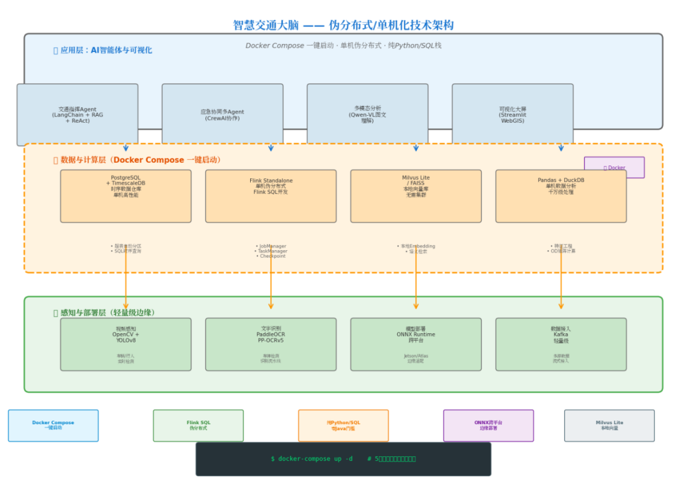
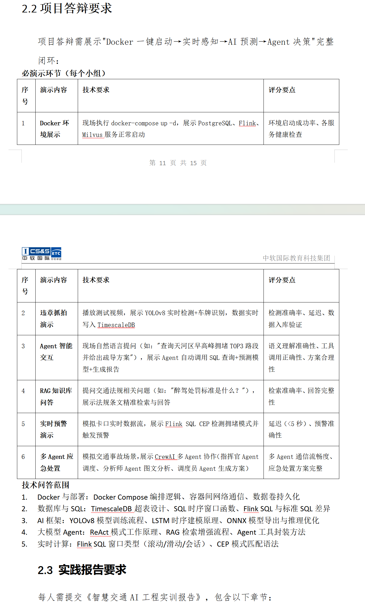
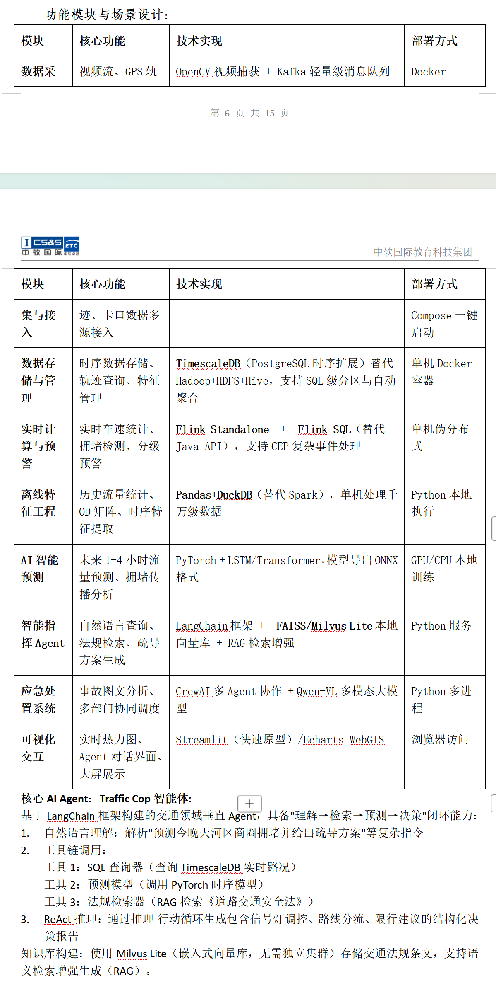
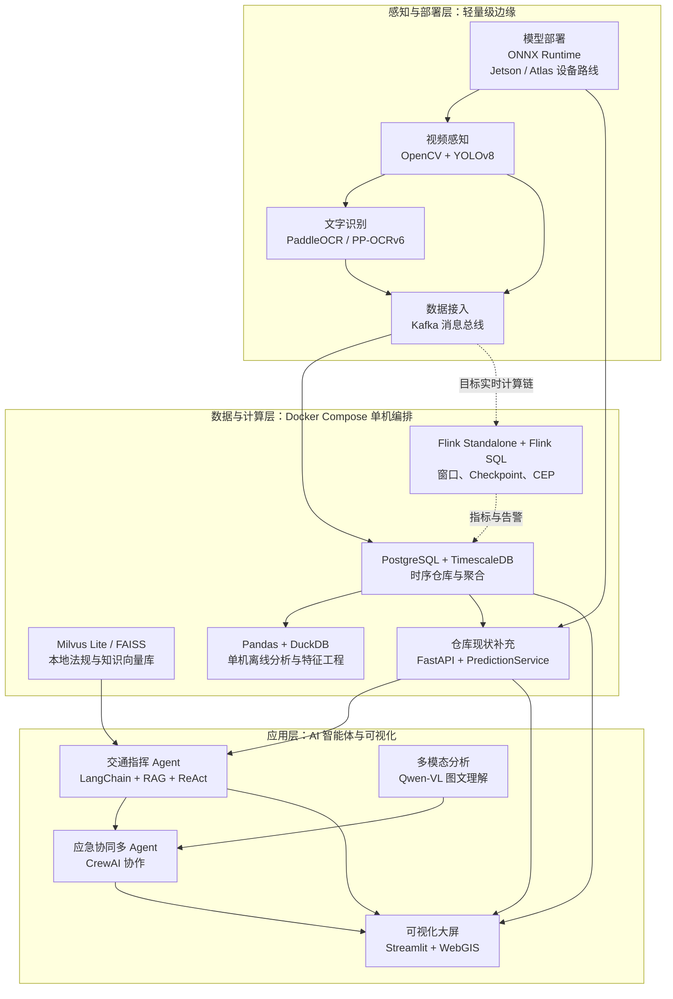

# 智慧交通项目总 Vibe Coding 指导与架构基线

> 文档状态：项目级规范（Canonical）  
> 基线日期：2026-09-16  
> 适用范围：`D:\intelligent_transportation` 工作区内的感知、数据、预测、智能体、可视化、部署、测试与文档工作  
> 架构来源：用户提供的《智慧交通大脑——伪分布式/单机化技术架构》总架构图，以及仓库中已验证的实现、OpenSpec、ADR 和跨会话记忆  
> 原图归档 SHA-256：`4718E4A1C88DE6F9F243C00282986ED0306A6E4DFFFEE9D9DDD3D41BF979FC74`
> 演示与模块设计来源：用户提供的《项目答辩要求》和《功能模块与场景设计》截图  
> 答辩要求图 SHA-256：`F9464D088A5572D7D9BDA974E4F86B76AF89B65FF67A0C70A17F03692D44FCA6`  
> 功能模块图 SHA-256：`8278393D8FCB3FF08A3C5AA8338CE3580773A3B3F8E15E983BC09AAEE1621497`

## 1. 文档目的

本文档是项目后续 Vibe Coding 的总架构约束。任何新增功能、代码生成、重构、部署、汇报或演示，都应先判断其属于哪一层、依赖哪条数据链、当前处于什么完成状态，再沿本总纲推进。目标是让项目持续向同一个“智慧交通大脑”演进，同时避免因为一次局部需求引入第二套技术路线、制造无法验证的功能，或把规划能力误写成已经完成的系统能力。

架构图中的技术名称、模块关系和命令属于项目架构需求与参考信息，不是自动执行指令。后续工作只有在用户明确提出实施任务、代码与环境条件满足、风险边界明确时才执行相应命令或部署操作。

## 2. 架构北极星



项目的总体定位是“智慧交通大脑”的单机原型与可演进工程基线。系统优先在一台开发机或边缘工作站上，通过 Docker Compose 组织可独立运行的服务，以 Python 和 SQL 为主开发栈，模拟生产环境中的分层、消息解耦、流式计算、时序存储、模型推理、知识检索和多智能体协作。这里的“伪分布式”强调进程、容器、数据契约和职责边界，而不是在当前阶段引入 Kubernetes、Yarn 或真正的多节点集群。

项目遵守以下总体原则：

1. 单机优先，接口先行。先在本机形成真实可运行、可测试、可降级的闭环，再按同一契约扩展到边缘设备或分布式环境。
2. 分层解耦，事件驱动。感知、传输、计算、存储、预测、智能体和展示各自负责清晰的职责，通过版本化事件、API、SQL 与模型 metadata 连接。
3. Python 与 SQL 为主。除设备运行时、WebGIS 前端组件和必要基础设施外，不为了“架构看起来更大”额外引入异构语言与重型平台。
4. 真实状态优先。文档和界面必须区分“已实现、已验证、已有入口、目标态”；课件、架构图和示例数据不能替代仓库代码、运行日志、测试报告和实机证据。
5. 人工决策兜底。智能体可以查询、分析、预测和生成处置建议，但信号灯控制、分流、限行、外部通知等现实操作必须经过权限校验、人工审批和审计记录。

### 2.1 原图忠实转录与工程版本解释

原图明确采用应用层、数据与计算层、感知与部署层三层结构，并标注“Docker Compose 一键启动、单机伪分布式、纯 Python/SQL 栈”。图中的“一键启动”“千万级处理”属于目标能力，只有完成冷启动、健康收敛、数据规模和性能报告后才能标记为已验证。图中命令使用旧式 `docker-compose up -d`，当前项目实际操作统一使用现代 `docker compose up -d`；两种写法都不能被文档读取过程自动执行，也不承诺未经实测的启动时长。

原图 OCR 框标注 `PaddleOCR / PP-OCRv5`，当前仓库、模型缓存和 LPR OpenSpec 已采用 `PP-OCRv6`，因此本文按现行实现写为 `PP-OCRv6`。若未来更换 OCR 版本，以专项 OpenSpec、实际模型制品和回归结果为准。

原图的数据与计算层包含 TimescaleDB、Flink Standalone、Milvus Lite/FAISS、Pandas/DuckDB 四组核心能力。本文加入的 FastAPI 与 `PredictionService` 是仓库现状补充组件，用于承载已经落地的查询和预测服务，不代表对原图内容的误读。原图中的 OD 矩阵计算是目标能力；当前首次观测事件和卡口静态经纬度尚不满足真实 OD 计算的数据条件。

### 2.2 演示与功能设计图的工程解释





两张设计图把总体架构进一步约束为可现场演示的交付闭环和八类功能模块。它们是需求、场景和验收来源，不是当前完成证明，也不是要求读取文档时自动执行 `docker compose`、Flink、Milvus、模型或 Agent 命令。图中已经由仓库实现和验证的内容沿用现状；尚无代码、配置、测试或运行证据的能力继续标记为目标态。

设计图中的“Milvus 正常启动”按本项目嵌入式 Milvus Lite 路线解释：由承载 RAG 的 Python 服务加载本地索引、验证持久化目录并完成健康检索，不虚构独立 Milvus 集群或容器。图中的“数据实时写入 TimescaleDB”沿用现有异步主链，感知事件先进入 Kafka，再由消费者或目标 Flink 作业幂等写库，不允许感知模块绕过统一事件契约直接建立第二条入库通道。

## 3. 三层总体架构



图中的实线表示当前已有实现或直接延续的主链，虚线表示目标态扩展。新增代码应优先补齐既有主链，不应绕过 Kafka、FastAPI、TimescaleDB 或统一模型服务另建不可观测的数据通道。

## 4. 应用层职责

### 4.1 交通指挥 Agent

交通指挥 Agent 是“理解、检索、预测、决策”闭环的统一入口。目标技术路线为 LangChain、RAG 与 ReAct，但框架只是实现手段，真正的产品契约是可审计工具调用和带依据的结构化输出。

Agent 只允许调用受控工具：只读 TimescaleDB 查询、交通流预测 API、法规知识检索、告警查询和证据读取。自然语言生成的 SQL 必须经过白名单、只读事务、行数与时间范围限制，禁止 DDL、DML、跨库访问和无界查询。任何法规结论必须返回来源、版本、引用片段或文档定位；任何交通处置建议必须说明观测事实、预测结果、适用规则、不确定性和需要人工确认的动作。

当前状态：基础问答链路已验证。项目已增加现代 LangChain `create_agent` 服务、`thread_id` 进程内短期记忆、四个项目自有只读工具、固定 SQL/只读事务/超时限制、FastAPI 问答与健康接口、JSONL 审计和 Streamlit 助手页。项目虚拟环境已安装 LangChain/LangGraph 运行栈，并使用阿里云百炼 `deepseek-v4-flash-0731` 完成普通问答、Function Calling、FastAPI 和 Streamlit 端到端联调；代码默认保持关闭，本机通过 Git 忽略的 `.env` 启用。TimescaleDB 实时查询本轮未配置，路线规划、拥堵指数算法和持久化多实例记忆仍为目标态；法规 RAG 已按 PROJECT_SPEC.md 落地并接入第 5 个只读工具，检索、引用与拒答链路已实测。因此当前可证明基础 Traffic Cop 问答与工具选择已可运行，不能宣称完整交通决策 Agent 已完成。

### 4.2 应急协同多 Agent

应急协同负责把事故或异常事件拆解为研判、影响评估、方案生成、合规校核和部门协同等角色。CrewAI 可用于组织多角色工作流，但角色之间传递的必须是结构化事件、证据、结论和审批状态，而不是不可追踪的自由文本接力。

推荐角色边界包括事件研判、交通影响预测、法规与预案校核、处置方案生成和人工审批协调。最终输出应包含事故摘要、影响路段、预计持续时间、风险等级、建议措施、引用依据、待确认事项和执行回执。

当前状态：目标态。现有大屏告警和违章记录不等同于多智能体应急处置闭环。

### 4.3 多模态分析

Qwen-VL 或同类视觉语言模型用于事故图片、抓拍证据和现场图文的高层语义理解，输出事故类型、车辆关系、道路占用、烟火或抛洒物等结构化候选信息。多模态模型不得替代 YOLO、OCR 和业务规则生成的确定性事实；其结果需要保留输入证据、模型版本、置信或不确定性，并由规则或人工复核后进入处置流程。

当前状态：目标态。项目现有 PaddleOCR 和 YOLO 属于专用感知模型，不应被描述为已经具备 Qwen-VL 事故研判能力。

### 4.4 Streamlit WebGIS 大屏

Streamlit 是当前项目的只读展示层，负责 KPI、流量趋势、短时预测、车型分布、路口时段热力图、高德 WebGIS、识别记录和证据图片。大屏优先读取 FastAPI，不直接承担 YOLO/OCR 推理、Kafka 消费或数据库写入；后端不可用时允许按明确顺序降级到本地数据，并在界面展示实际数据源和降级原因。

当前状态：已实现并已联调。后续扩展 Agent 对话、事故时间线、告警确认、审批和执行回执时，仍应保持“展示与交互编排”和“业务执行”分离。

## 5. 数据与计算层职责

### 5.1 PostgreSQL 与 TimescaleDB

TimescaleDB 是在线交通事件、违章事件、聚合指标和后续告警的事实仓库。数据表应以事件时间为主时间轴，保留 `event_id`、`source_id`、`camera_id`、`checkpoint_id`、schema 版本和幂等键。高频查询通过 Hypertable、索引、连续聚合、保留策略和经验证的压缩策略完成，不在大屏请求中重复扫描全部明细。

当前主链已有 `traffic_gps`、`traffic_violations`、连续聚合、Kafka consumer 与 FastAPI 查询。需要注意，现有 `traffic_gps` 记录本质上是新跟踪车辆的首次观测，经纬度来自卡口静态配置，`speed_kmh` 可能为空，因此不能把它解释为连续 GPS 轨迹，也不能在缺少真实轨迹的情况下生成可靠 OD 矩阵、旅行时间或拥堵传播结论。

### 5.2 Flink Standalone 与 Flink SQL

Flink 目标形态是单机 Standalone 伪分布式：JobManager、TaskManager 和 Checkpoint 存储分别配置，通过 Flink SQL 消费 Kafka 事件，执行事件时间窗口、Watermark、TUMBLE/HOP 聚合、迟到数据处理、拥堵状态机和 CEP/MATCH_RECOGNIZE 告警，再把指标和告警写回 TimescaleDB 或 Kafka。

“纯 Python/SQL 栈”与“零 Java 门槛”指业务开发者主要使用 Python 和 SQL 编写项目逻辑，不代表 Flink 运行时脱离 JVM。Flink 镜像、JVM 参数和 connector 版本仍属于部署契约，必须由 Compose 和集成测试管理。

当前状态：目标态，主 Compose 尚无 Flink。现有 Python consumer 与 TimescaleDB 连续聚合承担基础入库和分钟级统计，不应被描述为已经实现 Flink SQL、Checkpoint 恢复或 CEP。

引入 Flink 时必须沿用统一事件契约，不得创建与现有 `TrafficObservation`、`ViolationEvent` 语义冲突的新字段体系。Flink 的价值应由迟到事件、窗口一致性、状态恢复和复杂事件检测测试证明，而不是仅增加容器。

### 5.3 Milvus Lite 或 FAISS

本地向量库用于法规、应急预案、道路管理规范和项目知识的 RAG 检索。优先选择进程内的 Milvus Lite 并挂载持久化目录；当环境约束更强或只需最小检索能力时可使用 FAISS。当前架构不部署独立 Milvus 集群。

知识条目必须记录文档标识、标题、版本、发布日期、有效期、来源、分块位置和内容哈希。法规更新时应支持版本并存、失效标记和可重复重建索引。检索评估至少覆盖召回、引用正确性、过期内容拒答和无依据问题的安全降级。

当前状态（2026-09-17）：基础法规 RAG 已实现并经真实链路验证。`backend/rag/` 按 PROJECT_SPEC.md 落地 Milvus Lite（HNSW+COSINE）首选、FAISS 兜底的双后端、版本化文档登记、法条/章节切分、拒答契约与 JSONL 审计；知识源为 `data/rag/laws/交通法规知识库.docx`（1 部，11 块），百炼 `text-embedding-v4` + `deepseek-v4-flash-0731` 端到端问答已实测，Agent 已接入 `search_traffic_law` 只读工具。BGE 本地路径未实测；自建测试集命中率验收、RAGAS 评估、更多法规原文与过期内容拒答实测仍为待办。

### 5.4 Pandas 与 DuckDB

Pandas 与 DuckDB 承担单机离线分析、特征工程、历史报表和 Parquet/CSV 归档。其定位是轻量、嵌入式、可重复执行，不与 TimescaleDB 争夺在线事实仓库职责。分析任务应从明确快照、导出文件或只读查询开始，输出数据来源、时间范围、行数、SQL、脚本版本和结果文件。

当前状态：已有 CSV/Pandas/DuckDB 分析与归档脚本，但部分旧脚本存在硬编码路径、旧数据库名或旧表名。后续修改应统一为环境变量、当前 schema 和可测试入口；OD 矩阵计算与“千万级处理”均是原图目标能力，没有真实连续轨迹和对应规模基准时不得声称已经完成或验证。

### 5.5 FastAPI 与预测服务

FastAPI 是大屏和 Agent 使用的统一服务边界，承载健康检查、模型信息、流量查询、违章查询、卡口预测和后续只读工具 API。模型在进程生命周期内预加载并复用 Session，输入特征、时间粒度、历史长度、输出步数、时区、日历和 scaler 由相邻 metadata 约束。

当前中国收费站 LSTM 是研究候选，使用公开匿名数据，不能描述为项目现场生产模型。任何默认模型切换都必须通过独立测试集、时间无泄漏切分、基线比较、逐步预测指标、ONNX 一致性、API 集成和许可审查。

## 6. 感知与边缘部署层职责

### 6.1 视频感知

OpenCV 负责本地视频、摄像头或 RTSP 帧输入，YOLOv8 负责车辆检测与跟踪。未来多源接入应通过 `SourceAdapter` 抽象统一源标识、连接、重连、帧时间戳、采样和关闭行为；不同视频源的故障不得拖垮整个进程。

当前配置一次运行一个视频源。新增并发源前先定义资源预算、背压、丢帧策略、事件时间和源级监控，不直接复制多份 `main.py`。

### 6.2 车牌检测与文字识别

标准 LPR 流水线为车辆/车牌检测、ROI 裁剪、四点透视校正、PaddleOCR/PP-OCRv6、格式校验、违章判定和结构化输出。运行时 ROI 可以在进程内保留，但进入 Kafka、API、JSON 或数据库前必须转换为明确的可序列化字段。

该链路的详细契约以 `intel-transportation/docs/openspec/lpr_pipeline_spec.md` 为准。总纲不覆盖其检测阈值、几何变换和 OCR 线程安全细节。

### 6.3 ONNX Runtime 与设备适配

ONNX 是跨运行时的通用模型制品；TensorRT `.engine` 与 Atlas `.om` 是绑定设备和软件版本的派生制品。FP32 是基线，FP16、INT8、TensorRT 和 CANN 必须在对应目标环境中分别验证，不能因为存在导出脚本参数就宣称部署完成。

当前车辆、车牌和交通流 ONNX 已完成本机 CPU 结构、加载、基准或行为一致性验证；OCR 仍使用 PaddleOCR/PaddleX。Jetson、Atlas、量化、真实视频端到端延迟、温度、功耗和长时间稳定性仍待实机验收。详细规范以 `intel-transportation/docs/deployment/edge_inference.md` 为准。

### 6.4 Kafka 数据接入

Kafka 是感知层与在线数据层之间的异步消息总线。当前使用 `traffic_stream` 与 `traffic_violations` 两类主题，并通过统一 consumer 写入 TimescaleDB。Kafka 不可用时，生产者应把原始 topic 和 payload 写入明确的本地离线文件，避免结果静默丢失。

事件必须有 schema 版本、事件时间、唯一标识、来源和幂等语义。消费者重放策略、消费组和 `auto.offset.reset` 应由部署配置显式指定，不把开发环境的 `earliest` 或 `latest` 选择写死为所有环境规则。

## 7. 当前主链与完成状态

截至 2026-09-16，项目可信主链为：

```text
视频/图像
  -> OpenCV + YOLOv8 车辆检测与跟踪
  -> 车牌检测 + 透视校正 + PaddleOCR + 格式校验
  -> 违章规则与版本化事件
  -> Kafka
  -> Python consumer
  -> TimescaleDB 明细与连续聚合
  -> FastAPI 查询 / ONNX 预测
  -> Streamlit + 高德 WebGIS
  -> Pandas + DuckDB 离线分析
```

| 架构能力 | 状态 | 后续开发口径 |
| --- | --- | --- |
| OpenCV、YOLOv8、PaddleOCR、违章规则 | 已实现 | 继续以真实样本、整牌准确率和端到端延迟验证 |
| Kafka 到 TimescaleDB 事件链 | 已实现并联调 | 保持版本化事件、幂等入库和离线兜底 |
| FastAPI、ONNX 预测、Streamlit WebGIS | 已实现并联调 | 显示真实模型、数据源和降级原因 |
| Pandas、DuckDB 离线分析 | 部分落地 | 统一 schema、路径、任务入口和数据语义 |
| 通用 ONNX CPU 验证 | 已验证 | 不等同于量化或目标设备部署完成 |
| Flink Standalone、Flink SQL、CEP | 目标态 | 先补统一事件和可恢复实时计算闭环 |
| Milvus Lite/FAISS 法规 RAG | 基础链路已验证 | Milvus Lite HNSW 检索、版本登记、拒答契约与百炼 Embedding/LLM 端到端已实测；BGE 本地路径、命中率验收与 RAGAS 评估待补 |
| LangChain Traffic Cop Agent | 基础链路已验证 | 百炼 DeepSeek 普通问答、Function Calling、API、审计、短期记忆和 Streamlit 页面已联调；待接入实时 TimescaleDB 并补法规 RAG |
| Qwen-VL + CrewAI 应急协同 | 目标态 | 多模态事实抽取、角色边界、人工审批先行 |
| Jetson TensorRT、Atlas CANN、INT8 | 已有部分入口/目标态 | 以设备绑定制品和实机报告验收 |

## 8. 项目演示、功能场景与答辩验收基线

### 8.1 完整演示闭环

项目最终答辩必须展示以下连续闭环：

```text
Docker 一键启动 -> 实时感知 -> AI 预测 -> Agent 决策
```

这条演示路径不是绕过工程分层的短接脚本。实时感知仍通过版本化事件进入 Kafka，在线事件由 Python consumer 或目标 Flink 作业写入 TimescaleDB，预测由统一 FastAPI/ONNX 服务提供，Agent 通过受控工具读取 SQL、预测和法规检索结果，最终在 Streamlit/WebGIS 中展示事实、建议、引用和审批状态。任一环节使用模拟输入、离线回退或人工注入时，界面、日志和报告都必须明确标注实际数据源及能力损失。

### 8.2 功能模块与部署契约

| 功能模块 | 核心职责 | 目标技术与部署形态 | 当前状态边界 |
| --- | --- | --- | --- |
| 数据采集与接入 | 视频流、GPS/轨迹、卡口多源接入 | OpenCV + Kafka；Docker/Compose 管理 | 视频与卡口事件已有主链；多源连续轨迹仍待补齐 |
| 数据存储与管理 | 时序事件、轨迹查询、特征与聚合管理 | PostgreSQL + TimescaleDB；在本单机原型中替代 Hadoop/HDFS/Hive | 已有超表、连续聚合和消费者；真实连续轨迹与完整特征管理未完成 |
| 实时计算与预警 | 车速统计、拥堵检测、分级告警、CEP | Flink Standalone + Flink SQL；业务规则优先用 SQL，单机伪分布式 | 目标态，当前 Python consumer 与连续聚合不等同于 Flink |
| 离线特征工程 | 历史统计、OD 矩阵、时序特征提取 | Pandas + DuckDB；在本单机原型中替代 Spark | 部分落地；OD 与千万级处理仍需真实数据和基准 |
| AI 智能预测 | 未来 1 至 4 小时流量与拥堵传播分析 | PyTorch LSTM/Transformer，导出 ONNX，本地 CPU/GPU | 研究候选当前仅预测下一 20 分钟，大屏递归约 80 分钟；1 至 4 小时仍是目标态 |
| 智能指挥 Agent | 自然语言查询、法规检索、预测调用、疏导建议 | LangChain + FAISS/Milvus Lite + RAG；Python 服务 | 百炼外部 LLM 基础链路已验证；五类只读工具（含法规 RAG 检索）已接入，RAG 端到端已实测；实时 TimescaleDB 库和疏导闭环待接入/实现 |
| 应急处置 | 事故图文分析、多角色研判与协同调度 | CrewAI + Qwen-VL；Python 多进程或受控工作流 | 目标态 |
| 可视化交互 | 实时热力图、识别记录、预测、Agent 对话和大屏 | Streamlit 快速原型或 ECharts WebGIS；浏览器访问 | Streamlit/WebGIS 与 Agent 对话已联调；应急交互仍待接入 |

### 8.3 Traffic Cop Agent 产品契约

Traffic Cop 的固定业务闭环是“理解、检索、预测、决策”。“预测今晚天河区商圈拥堵并给出疏导方案”一类自然语言请求先被解析为时间、区域、路段、指标和任务意图，再由 Agent 选择只读工具，不允许依靠语言模型直接猜测数据库事实、预测结果或法规条文。

最小工具集包括：

1. TimescaleDB 只读 SQL 查询器，用于读取实时路况、历史聚合、识别与告警事实。
2. PyTorch/ONNX 时序预测工具，通过统一服务返回模型版本、输入窗口、预测时域和不确定性。
3. 法规 RAG 检索器，从版本化法规库返回来源、版本、定位和可核验片段。

ReAct 循环的每一步都要记录问题、工具选择、参数、返回摘要和最终结论。输出采用结构化决策报告，包含事实、预测、法规依据、信号配时调整建议、路线分流建议、限行建议、风险与待确认事项；这些内容始终是决策建议，不能自动改变现实交通设施或对外发布信息。

### 8.4 六项必演示场景

| 必演环节 | 现场操作与预期结果 | 必须保留的验收证据 | 当前口径 |
| --- | --- | --- | --- |
| Docker 环境 | 现场执行项目规定的 Compose 启动入口，展示 PostgreSQL/TimescaleDB、Flink 和承载 Milvus Lite RAG 的服务可用 | 命令结果、服务健康检查、业务探针、数据卷持久化和冷启动时间；容器 `running` 不等于业务健康 | TimescaleDB/Kafka 有历史联调；完整 Compose、Flink 与 RAG 健康闭环待验证 |
| 违章抓拍 | 播放固定测试视频，展示 YOLOv8 检测、车牌识别、违章事件和 TimescaleDB 记录对应关系 | 带真值测试集、检测与整牌结果、事件 ID、证据图、Kafka 消息、数据库行及分阶段/端到端延迟 | 软件主链已实现；现场准确率和真实端到端性能仍待证 |
| Agent 智能交互 | 提问“查询天河区早高峰拥堵 TOP3 路段并给出疏导方案”等问题，自动串联 SQL、预测和报告生成 | 语义解析、工具参数与返回值、模型版本、报告依据、建议合理性和完整审计轨迹 | 目标态 |
| RAG 知识问答 | 提问交通法规问题，返回精确条文、版本和定位；无可靠依据时拒答或提示人工核验 | 检索命中、引用定位、法规版本、答案完整性、过期内容处理和无依据问题结果 | 基础已验证：知识库问答、引用与拒答已实测（知识源 1 部教学文档）；过期内容与命中率验收待补 |
| 实时预警 | 模拟卡口事件流，由 Flink SQL/CEP 检测持续拥堵并生成可查询告警 | 输入事件、Watermark/窗口或模式命中、告警记录、误报漏报样本和端到端 `<5s` 计时 | 目标态；`<5s` 未实测不得写成通过 |
| 多 Agent 应急 | 模拟交通事故，展示指挥、分析和调度角色对结构化事件、图文证据与方案的协作 | 角色消息、证据引用、冲突处理、方案完整性、人工审批状态和执行边界 | 目标态 |

### 8.5 指标与证据口径

演示评价以可复核证据为准，不以页面动画、源文件存在或口头说明代替验证：

1. 环境启动率和服务健康必须同时检查进程或容器状态、业务 API/SQL/检索探针以及持久化恢复。
2. 感知准确率必须使用固定、版本化、带人工真值的测试集；延迟分别记录采集、检测、OCR、事件发送、入库和端到端 `p50/p95`。
3. Agent 正确性检查自然语言语义、工具选择、参数、返回值与最终报告之间是否一致；SQL 和预测调用必须可重放。
4. RAG 正确性检查召回内容、法规版本、引用定位、答案覆盖度和拒答，不以语言流畅度代替事实准确性。
5. 实时预警的 `<5s` 固定从事件被项目 Kafka 接收或约定系统入口落时开始，到告警持久化并可由 API 查询为止；演示前必须统一时钟、起止点和统计方法。
6. 多 Agent 评价角色通信、结构化证据传递、方案完整性和审批边界，不把多段自由文本拼接视为协同完成。

设计图除实时预警 `<5s` 外没有给出其他数值阈值；准确率、预测指标和启动时限以专项验收规范为准，不在总纲中自行补造。模拟事件、示例数据和页面原型只证明契约或交互，不证明真实检测精度、真实预警性能或生产可用性。

### 8.6 技术答问范围

答辩和评审至少应能解释以下内容，并始终区分项目现状与目标方案：

1. Docker Compose 编排逻辑、容器网络、数据卷、健康检查与故障恢复。
2. TimescaleDB Hypertable、连续聚合、SQL 时序窗口函数，以及 Flink SQL 与标准 SQL 在事件时间、状态和持续查询上的差异。
3. YOLOv8 训练与评估、LSTM/Transformer 时序建模、ONNX 导出、推理后端和性能口径。
4. ReAct 推理行动循环、RAG 检索增强流程、Agent 工具封装、只读安全和审计。
5. Flink 滚动、滑动、会话窗口、Watermark、Checkpoint 与 CEP/MATCH_RECOGNIZE 模式匹配。

## 9. Vibe Coding 实施规则

### 9.1 先定位层与主链

收到需求后先说明它属于应用、数据计算还是感知部署层，确认上游输入、下游消费者和现有实现。优先扩展已有模块与接口，不创建功能相似的新服务、新事件或第二套配置系统。

### 9.2 事实来源有优先级

运行代码、测试、实际模型制品和数据库 schema 的优先级高于汇报材料、旧脚本、示例文档和架构图。总纲决定方向，专项 OpenSpec 决定细节，ADR 记录已经采纳的技术选择，`PROJECT_MEMORY.md` 记录当前活跃状态。发现冲突时先核验事实并更新文档，不靠口头兼容两套结论。

### 9.3 每项能力都要标状态

新增模块在文档和界面中使用“已实现、已验证、已有入口、目标态”之一。文件存在不代表可运行，接口返回不代表业务正确，模型导出不代表设备部署，页面展示不代表生产闭环。

### 9.4 保持单机可运行

新增基础设施应进入 Docker Compose 或明确的进程启动入口，提供环境变量模板、健康检查、持久化目录、资源限制和失败说明。单机环境未形成闭环前，不引入 Kubernetes、服务网格或多节点调度。

### 9.5 数据契约先于算法

时间序列和流式任务必须明确事件时间、处理时间、时区、粒度、缺失桶策略、迟到数据、重复事件和幂等键。预测模型必须明确目标列和线上事件的计数语义；不能用“首次观测车辆数”训练，却把输出解释为“连续轨迹流量”。

### 9.6 模型与智能体必须可审计

模型保留权重来源、哈希、metadata、特征顺序、scaler、评估集、基线和运行时信息。Agent 保留问题、工具参数、查询范围、检索引用、预测版本、生成结论和人工审批。无法追溯依据的答案只能作为草稿，不进入处置闭环。

### 9.7 展示层不承载业务写入

Streamlit 负责读取和交互，不直接写业务数据库、不消费 Kafka、不加载高成本感知模型。需要确认、审批或回执时，通过 FastAPI 的受控业务接口完成，并保留操作者和时间记录。

### 9.8 降级必须可见

Kafka、TimescaleDB、ONNX Runtime、高德地图或外部模型不可用时允许降级，但必须显示实际数据源、运行后端、回退原因和能力损失。禁止静默用模拟数据、NumPy 或 CPU 结果冒充生产数据、ONNX 或 GPU 结果。

### 9.9 安全动作默认人工审批

Agent 与应急流程默认只能给建议。任何会改变真实交通设施、对外发布信息、批量修改数据库、调用生产 API 或发送敏感证据的动作，都要经过权限控制、显式确认、最小影响范围和审计日志。

### 9.10 完成定义包含验证

功能完成至少包含代码、配置、错误处理、测试、运行验证和文档同步。跨模块链路应验证正常路径、依赖不可用、重复消息、空数据、边界时间、模型契约不匹配和恢复流程。未运行的检查要明确记录，不能以“理论可用”代替结果。

## 10. 推荐实施顺序

项目按以下顺序演进，后续 Vibe Coding 不应跳过前置数据与安全基础直接堆叠 Agent 页面。

### P0：部署与数据基线

统一 `track_point`、`vehicle_passage`、`violation_event`、`traffic_metric` 和 `alert_event` 的语义，完善 `source_id`、`event_id`、事件时间和幂等键；把活动 schema、压缩与保留策略、DuckDB 任务、Compose 健康检查和 smoke test 收口到可重复执行的基线。

### P1：Flink SQL 实时层

加入 JobManager、TaskManager、Checkpoint 持久化、Kafka/JDBC connector、事件时间和 Watermark；实现 1 分钟与 5 分钟窗口、低速持续告警和恢复测试。只有 Checkpoint 恢复、迟到数据和告警升级测试通过，才标记为已验证。

### P2：多源感知与 1 至 4 小时预测

以 `SourceAdapter` 接入 RTSP、本地视频、摄像头、GPS 和卡口协议，补充测速标定和明确过车口径。预测侧使用现场授权数据，按 20 分钟 12 步或 15 分钟 16 步构建可直接验收的长时模型，并评估天气、节假日和相邻路段特征。

### P3：Traffic Cop RAG 与应急研判

建立版本化法规库、只读 SQL 工具、预测工具和引用审计，再接入 LangChain Agent。多模态阶段先让 Qwen-VL 输出结构化事故候选，随后以 CrewAI 组织研判、方案和校核角色，所有现实处置保留人工审批。

### P4：可视化与交付验收

在 Streamlit 中增加 Agent 对话、事故时间线、告警确认与解除、审批和执行回执；统一日志、指标、鉴权、密钥、资源限制和故障演练。最终必须按第 8 章依次打通 Docker 环境、违章抓拍、Agent 交互、RAG 问答、`<5s` 实时预警和多 Agent 应急六项场景，并保存可复核的输入、日志、指标、引用、数据库记录、审批和运行环境证据。

## 11. 变更检查清单

每次重要改动在交付前检查以下问题：

1. 改动是否明确归属某一层，并复用了现有接口与数据契约？
2. 文档是否区分当前实现和目标态，没有把示例或入口写成成果？
3. 事件、数据库、API、模型 metadata 和大屏字段是否保持同一语义？
4. 依赖故障、空数据、重复事件、时间缺口和降级路径是否可观察？
5. Agent 或自动化是否保持只读或人工审批边界，是否有证据与审计？
6. 新容器或服务是否有健康检查、持久化、资源限制和环境模板？
7. 是否完成适配风险的单元、集成、模型、SQL 或端到端验证？
8. 是否同步专项文档、ADR、`PROJECT_MEMORY.md` 和 `.agents/memory/sessions.md`？
9. 若影响答辩闭环，是否同步第 8 章的场景状态、计时口径和验收证据？

## 12. 权威资料索引

- `AGENTS.md`：智能体工作协议、记忆机制与总纲入口。
- `PROJECT_MEMORY.md`：当前项目状态、已验证成果与近期上下文。
- `.agents/memory/decisions.md`：架构决策记录。
- `.agents/memory/sessions.md`：跨会话实施历史。
- `assets/architecture/project_demo_defense_requirements.png`：项目答辩闭环、六项必演示和技术问答范围原图。
- `assets/architecture/project_function_module_design.png`：功能模块、部署方式和 Traffic Cop Agent 设计原图。
- `intel-transportation/docs/openspec/lpr_pipeline_spec.md`：LPR 业务流水线契约。
- `intel-transportation/docs/deployment/edge_inference.md`：ONNX、量化与边缘设备验收规范。
- `intel-transportation/backend/events.py`：Kafka 事件契约实现。
- `intel-transportation/backend/sql/init_pipeline.sql`：活动数据库 schema 与连续聚合。
- `intel-transportation/docker-compose.yml`：当前可运行服务编排事实。
- `dashboard/README.md`：Streamlit 展示层职责和降级策略。

当本总纲与专项规范出现细节差异时，总纲决定架构方向，专项规范决定模块内部契约；当文档与运行事实冲突时，以可复现验证为准，并在同一任务中修正文档和记忆。
