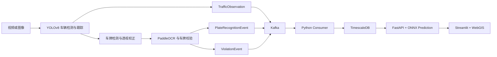

# 智慧交通车辆检测、车牌识别与流量预测系统

本仓库实现智慧交通项目的单机软件链路：OpenCV/YOLOv8 负责车辆与车牌感知，PaddleOCR 负责字符识别，Kafka 传递版本化事件，TimescaleDB 保存交通观测、车牌识别和违章记录，FastAPI 提供查询与 ONNX 流量预测服务，Streamlit 大屏负责可视化展示。

项目级架构方向以工作区根目录的 `VIBECODING.md` 为准，车牌链路细节以 `docs/openspec/lpr_pipeline_spec.md` 为准。源课件与验收文档中的命令、示例技术栈和“已通过”描述只作为要求来源，不自动成为本工程事实。

## 当前可信状态

截至 2026-09-16，仓库已具备车辆/车牌识别代码、三类 Kafka 事件、TimescaleDB 入库、ONNX 预测 API、Streamlit 大屏、交通问答 Agent 基础入口、Docker Compose 编排、自动质量门禁和软件模拟验收入口。

当前实测通过 113 项自动化测试：核心与边缘工具 55 项、预测与 API 36 项、大屏 11 项、Agent 11 项；另有 1 项依赖临时 ONNX 导出制品的预测测试按设计跳过。中国收费站研究候选模型的独立测试 `R²=0.8644117562`，达到课程材料要求的 `R²>0.85`。该模型使用公开匿名历史数据，部署阶段仍为 `research_candidate`，不代表项目现场生产精度。

以下项目尚不能标记为真实验收通过：车辆检测 `mAP>0.8`、整牌准确率 `>=95%`、摄像头到大屏全链路 `<200ms`、Python 3.10 复验、Compose 全服务健康、RTX 3060/TensorRT、Jetson、Atlas 和 INT8 指标。业务代码覆盖率当前为 `64.535%`，低于材料要求的 80%；全仓宽口径 Ruff 扫描仍有 41 项存量问题。

## 系统链路



`PlateRecognitionEvent` 与违章语义解耦。常规车牌识别进入 `plate_recognitions`，实际违章才进入 `traffic_violations` 并保存证据图片。`TrafficObservation` 当前表示跟踪车辆的首次卡口观测，经纬度来自卡口配置；没有测速标定时 `speed_kmh` 保持为空。

## 目录

- `core/`：检测、车牌流水线、OCR、透视校正、车牌规则与违章规则。
- `backend/`：事件契约、Kafka 消费者、SQL、FastAPI 和预测服务。
- `backend/agent/`：现代 LangChain Agent、固定只读交通工具、短期记忆、审计和 API Router。
- `db/`：Kafka 生产端及离线 JSONL 回退。
- `edge/`：ONNX/TensorRT 导出入口、制品校验和模型级基准工具。
- `acceptance/`：项目1质量门禁与明确标记为模拟的软件联调器。
- `tests/`、`backend/prediction/tests/`：核心、边缘和预测测试。
- `docs/`：OpenSpec、部署说明、数据集指南和验收要求。
- `../dashboard/`：Streamlit 大屏、数据适配和地图组件。
- `../dashboard/pages/2_交通指挥助手.py`：交通问答、工具证据与能力限制页面。

## 交通指挥 Agent

Agent 复用现有 TimescaleDB 和 `PredictionService`，首期只开放卡口流量、峰值时间、车型分布和卡口预测四类工具。查询使用固定 SQL、只读事务、连接/语句超时、参数校验和行数限制，不允许模型生成并执行任意 SQL。路线规划、正式拥堵指数、真实 OD 和法规 RAG 尚未实现，系统 Prompt 会明确拒绝无依据回答。

Agent 代码默认关闭。当前项目虚拟环境已安装运行依赖，并已使用阿里云百炼 `deepseek-v4-flash-0731` 完成真实问答和工具调用联调；本机通过 Git 忽略的 `.env` 启用。部署环境可使用以下配置：

```text
TRAFFIC_AGENT_ENABLED=true
TRAFFIC_AGENT_PROVIDER=aliyun-bailian
TRAFFIC_AGENT_MODEL=deepseek-v4-flash-0731
DASHSCOPE_API_KEY=...
TRAFFIC_AGENT_BASE_URL=https://dashscope.aliyuncs.com/compatible-mode/v1
```

健康与问答接口为 `GET /api/v1/agent/health` 和 `POST /api/v1/assistant/query`。问答接口与预测接口共用 `X-API-Key`。未启用、缺少依赖或模型初始化失败时，Agent 显示降级状态，不影响现有预测 API 与流量大屏。

## 环境准备

材料指定 Python 3.10.x，工程声明支持 Python 3.10 至 3.13。正式验收应在 Python 3.10 环境再跑一次；当前开发机实测环境为 Python 3.13.2。

```powershell
python -m venv .venv
.\.venv\Scripts\python.exe -m pip install -r requirements.txt
.\.venv\Scripts\python.exe -m pip install -r requirements-dev.txt
Copy-Item .env.example .env
```

生产环境至少需要修改数据库密码、设置 `APP_ENV=production`、配置非空 `PREDICTION_API_KEY`，并将 `API_CORS_ORIGINS` 限制为实际大屏来源。API 默认不向客户端返回内部异常详情；仅本地排障时可临时设置 `API_EXPOSE_INTERNAL_ERRORS=true`。

## 本机感知链路

默认模式只对违章车辆执行车牌识别，以减少 OCR 开销：

```powershell
.\.venv\Scripts\python.exe main.py D:\path\traffic.mp4 --headless --recognition-mode violation_only
```

需要验证所有车辆的独立车牌事件时使用：

```powershell
.\.venv\Scripts\python.exe main.py D:\path\traffic.mp4 --headless --recognition-mode all
```

可通过 `--max-frames` 限制烟雾测试帧数。Kafka 不可用时，事件按原 topic 与 payload 写入 `KAFKA_OFFLINE_PATH` 指定的 JSONL 文件，不会静默丢弃。

## Docker Compose

静态检查：

```powershell
docker compose config --quiet
docker compose --profile acceptance config --quiet
```

常规服务：

```powershell
docker compose up --build -d
docker compose ps
```

主 Compose 包含 TimescaleDB、Kafka、事件消费者、预测 API 和 Streamlit 大屏。YOLO/PaddleOCR 感知进程仍由宿主机 `main.py` 启动，因此“Compose 可启动”不等同于真实摄像头感知链已容器化。

全新数据库卷会执行 `backend/sql/init_pipeline.sql`。已有卷如果创建于 `plate_recognitions` 表加入之前，需要在备份并明确确认后执行 `backend/sql/migrate_existing_pipeline.sql`；本项目不会在未确认时自动修改既有数据库结构。

## 软件模拟验收

`acceptance-simulator` 会生成带 `simulation=true` 的三类合成事件，验证 Kafka、consumer、TimescaleDB、预测 API 和 ONNX 模型的服务契约与编排。它不加载 YOLO/PaddleOCR，不测真实图像精度，也不证明真实端到端延迟或硬件性能。

```powershell
docker compose --profile acceptance up --build `
  --abort-on-container-exit `
  --exit-code-from acceptance-simulator
```

成功输出包含 `mode: simulated`、三类 `events_persisted` 和预测模型信息。若使用历史数据库卷而尚未执行新增表迁移，模拟器会失败并保留该事实边界。

## 测试与质量门禁

```powershell
.\.venv\Scripts\python.exe -m unittest discover -s tests -p "test_*.py" -v
.\.venv\Scripts\python.exe -m unittest discover -s backend\prediction\tests -t . -p "test_*.py" -v
.\.venv\Scripts\python.exe -m unittest discover -s backend\agent\tests -t . -p "test_*.py" -v
..\intel-transportation\.venv\Scripts\python.exe -m unittest discover -s ..\dashboard\tests -p "test_*.py" -v
.\.venv\Scripts\python.exe -m acceptance.run --profile full
```

完整门禁把结果分为 `PASS`、`FAIL`、`BLOCKED` 和 `NOT_VERIFIED`。退出码 `0` 表示全部通过，`1` 表示存在已证实失败，`2` 表示没有已证实失败但仍缺关键证据。详细要求见 `docs/acceptance/REQUIREMENTS.md`，运行方式见 `docs/acceptance/QUALITY_GATE.md`。

依赖安全审计：

```powershell
.\.venv\Scripts\python.exe -m pip_audit `
  -r requirements.txt -r backend\requirements.txt --progress-spinner off
```

## 验收证据边界

要完成真实验收，还需要提供或制作锁定版本的人工真值集，包括车辆框、车牌框和完整车牌文本；需要现场跨日期流量数据用于模型复验；需要摄像头、卡口、方向和测速标定；需要目标 GPU 或边缘设备及其运行时；还需要同一次真实运行的事件、数据库、预测响应、大屏截图或录屏。

CPU 模拟、随机张量基准、PT/ONNX 输出一致性和合成事件只能证明对应的软件行为，不得升级为真实 `mAP`、OCR 准确率、全链路时延、TensorRT、Jetson、Atlas 或 INT8 通过结论。
