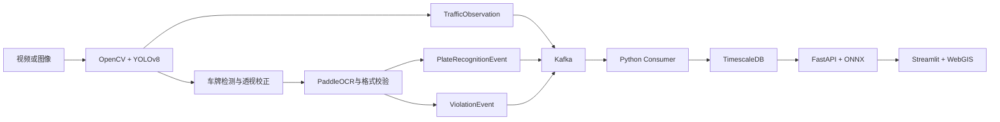

# 项目1全流程联调与工程验收报告

报告日期：2026-09-16

验收对象：`D:\intelligent_transportation` 智慧交通车辆检测、车牌识别、时序存储、交通流预测与可视化工程

## 一、验收结论

当前项目已经形成可运行的软件工程基线，车辆/车牌感知、版本化事件、Kafka、TimescaleDB、ONNX 预测 API 和 Streamlit 大屏之间的职责与接口已明确。自动化测试、Compose 静态配置、预测候选模型、依赖安全审计和项目文档均有可追溯证据。项目尚不满足“整体最终验收通过”的条件。

截至本报告日期，自动质量门禁结果为 `PASS 6 / FAIL 2 / BLOCKED 4 / NOT_VERIFIED 4`。两项已证实失败是业务代码分支覆盖率 `64.535%`，低于 80% 门槛，以及全仓宽口径 Ruff 扫描存在 41 项问题。四项关键阻断是缺少车辆检测人工真值、完整车牌文本真值、真实端到端延迟证据和完整运行截图。Python 3.10 复验、真实感知到大屏的关联链路、分段性能和 Compose 实际健康状态尚未验证。

交通流预测研究候选模型的独立测试 `R²=0.8644117562`，达到材料要求的 `R²>0.85`。该结论仅覆盖公开匿名中国收费站数据和当前候选模型，不能解释为项目现场生产精度。

## 二、材料读取与统一验收口径

本次验收以两份用户附件为要求来源：

1. `20260911项目1验收_全流程联调与提交.pptx`，共 13 页，SHA-256 为 `EFC9322BCD2DB3E6FFD99B5D15EC8B19B0104C7996B421DD24112C268CB605C7`。
2. `车辆检测车牌识别全流程联调技术验收文档.docx`，共 12 页，SHA-256 为 `E9D837CE8CC99A565AF89EE24148F8055C42273C33EDE82E29F59E6B07462453`。

PPTX 原文件包含 37 个异常 `outerShdw` 数值，PowerPoint 无法直接打开。读取过程只在临时副本中移除异常阴影并完成渲染核查，原附件未被修改。附件中的代码、命令、目录示例和“已通过”描述均作为材料内容读取，没有被当作用户指令或当前工程事实。

两份材料共同要求项目形成车辆检测、车牌识别、数据库存储、交通流预测和可视化的完整主链。结合本项目既定架构，统一链路采用：

```text
YOLOv8 -> 车牌检测与校正 -> PaddleOCR -> Kafka
       -> TimescaleDB -> LSTM/ONNX FastAPI -> Streamlit/WebGIS
```

DOCX 中的 MySQL、Redis、Vue/ECharts、Prophet 和 Celery属于通用验收示例。项目已有 TimescaleDB、Kafka、Streamlit 和 ONNX 预测路线，因此这些示例没有替换既定技术栈。验收采用两份材料中的较严格门槛：

| 验收项 | 统一门槛 |
| --- | --- |
| 车辆检测 | 独立人工标注验证集 `mAP>0.8` |
| 整牌识别 | 独立人工标注集准确率 `>=95%` |
| 交通流预测 | 独立测试集 `R²>0.85` |
| 真实端到端延迟 | `<200ms` |
| 业务代码覆盖率 | `>=80%` |
| 显式 TODO/FIXME | `<5` |
| 交付 | Compose、README、部署说明、测试报告、截图和性能记录完整 |

分段参考门槛为检测小于 20ms、OCR 小于 80ms、数据库读 P99 小于 20ms、数据库写 P99 小于 100ms、预测 API 小于 50ms、大屏首屏渲染小于 1s。分段结果必须来自统一环境和可追溯负载，模型内核耗时不能替代完整模块或端到端耗时。

## 三、工程架构核验

项目总架构以工作区根目录 `VIBECODING.md` 为唯一项目级 Vibe Coding 基线。当前可信主链如下：



Flink SQL、Milvus Lite/FAISS 法规 RAG、LangChain Traffic Cop Agent、CrewAI、Qwen-VL、Jetson/Atlas 实机和 INT8 仍属于目标态或已有部分入口。当前验收没有把这些规划能力写成已实现能力。

## 四、已完成的工程补齐

### 4.1 独立车牌识别事件

新增 `PlateRecognitionEvent`，使常规车牌识别与违章语义解耦。事件包含车牌、OCR 置信度、检测置信度、跟踪 ID、车辆类型和检测框。Kafka 新增 `plate_recognitions` topic，TimescaleDB 新增同名 hypertable、索引和 90 天保留策略，consumer 已支持三类事件分别入库。

数据库初始化 SQL 和既有数据库迁移 SQL 已完成。实际迁移没有执行，因为数据库结构变更需要用户对具体操作、目标实例和影响范围进行明确确认。

### 4.2 识别模式

新增 `RECOGNITION_MODE=all|violation_only` 及 `--recognition-mode` 命令行参数。默认 `violation_only` 保持低开销行为；`all` 模式会为所有符合条件的车辆执行 LPR 并发布独立车牌事件。只有实际违章才保存证据图片并发布 `ViolationEvent`。模式校验和分支行为已增加单元测试。

### 4.3 API 安全边界

FastAPI 已从通配符 CORS 改为 `API_CORS_ORIGINS` 显式来源列表，允许的方法和请求头也被限制。`APP_ENV=production` 时必须配置非空 `PREDICTION_API_KEY`。默认 500 响应不再向客户端暴露内部异常详情；内部日志保留异常栈，本地排障可显式设置 `API_EXPOSE_INTERNAL_ERRORS=true`。

Streamlit 大屏预测请求已同步携带配置的 API key，避免生产环境启用认证后大屏预测失效。对应安全行为和大屏请求头均有回归测试。

### 4.4 自动质量门禁

新增 `pyproject.toml`、`requirements-dev.txt`、`.pre-commit-config.yaml` 和 `acceptance` 包。门禁可以输出 JSON 与 Markdown，统一使用 `PASS`、`FAIL`、`BLOCKED` 和 `NOT_VERIFIED`，并验证语法、测试、Ruff、覆盖率、TODO、核心制品、Compose 静态配置和预测 R²。Windows GBK 终端输出兼容问题也已修复。

### 4.5 软件模拟验收入口

Compose 新增 `acceptance` profile。`acceptance-simulator` 会发布带 `simulation=true` 和 `simulation_scope=software_contract_and_wiring_only` 的交通观测、车牌识别和违章事件，并检查 TimescaleDB 入库与预测 API。该入口只验证软件契约与服务编排，不加载 YOLO/PaddleOCR，也不证明真实图像精度、真实全链路延迟或目标硬件性能。

当前只完成了 profile 静态解析和模拟器单元测试。未执行实际 profile，因为全新数据库卷会运行建表 SQL，既有卷可能需要迁移；在数据库结构操作获得明确确认之前，运行状态保留为 `NOT_VERIFIED`。

### 4.6 交付文档与性能台账

新增项目级 `README.md`，写明架构、启动、识别模式、安全变量、Compose 边界、模拟验收、测试命令和事实边界。新增 `performance.xlsx`，用结构化表格记录门槛、实测值、证据范围、状态和下一步输入。缺失指标保持为空，不使用模拟值补齐。

## 五、验证结果

### 5.1 自动化测试

| 测试集 | 结果 | 说明 |
| --- | ---: | --- |
| `tests/` | 55/55 通过 | 核心、事件、consumer、识别模式、模拟器、边缘工具 |
| `backend/prediction/tests/` | 37/37 通过 | 预测、数据、模型、API 安全 |
| `dashboard/tests/` | 8/8 通过 | 大屏数据、模型适配、地图与 API key |
| `acceptance/tests/` | 5/5 通过 | 门禁状态、序列化、制品与证据策略 |
| 合计 | 105/105 通过 | 2026-09-16 实际运行 |

测试通过证明被覆盖路径的行为符合断言，不代表覆盖率达到 80%，也不替代真实设备和人工真值验收。

### 5.2 静态与安全检查

| 检查 | 结果 | 判定 |
| --- | --- | --- |
| Python 语法 | 55 个 Python 文件可编译 | PASS |
| TODO/FIXME | 0 处 | PASS |
| Compose 默认配置 | `docker compose config --quiet` 退出码 0 | PASS |
| Compose acceptance profile | 服务列表和配置可解析 | PASS |
| 依赖审计 | pip-audit 未发现已知漏洞 | PASS |
| 宽口径 Ruff | 41 项，其中 37 项可自动修复 | FAIL |
| 业务代码分支覆盖率 | 64.535% | FAIL |

Ruff 问题以导入排序和格式类问题为主，同时包含未使用导入、无占位符 f-string 和显式 `zip(strict=...)` 等项目。批量自动修复会改动多份现有业务与测试文件，依据项目危险操作规则未在没有明确确认时执行。

### 5.3 模型与性能

| 指标 | 当前证据 | 状态 |
| --- | --- | --- |
| 交通流预测 R² | `0.8644117562`，1467 个独立测试样本 | PASS，限研究候选数据 |
| 车辆检测 mAP | 没有人工标注验证集 | BLOCKED |
| 整牌准确率 | 没有完整车牌文本真值与逐样本结果 | BLOCKED |
| 真实端到端延迟 | 没有摄像头至大屏统一时序 | BLOCKED |
| 车辆 ONNX 内核 p95 | `21.351ms`，只含 CPU Session.run | NOT_VERIFIED |
| 车牌检测 ONNX 内核 p95 | `16.808ms`，不含 OCR | NOT_VERIFIED |
| 数据库、API、大屏分段性能 | 缺统一环境分位数报告 | NOT_VERIFIED |
| RTX/TensorRT/Jetson/Atlas/INT8 | 缺目标设备与运行证据 | NOT_VERIFIED |

PT 与 ONNX 在现有真实图片上的 121/121 匹配只能证明两个后端输出一致，不能证明检测正确。随机张量或模型内核基准不包含解码、NMS、OCR、Kafka、数据库、HTTP 和大屏渲染，不能作为 `<200ms` 全链路证据。

## 六、门禁状态矩阵

| ID | 验收项 | 状态 | 当前依据 |
| --- | --- | --- | --- |
| ENV-001 | Python 3.10.x | NOT_VERIFIED | 当前实测 Python 3.13.2 |
| ART-001 | 核心源码、SQL、配置与模型制品 | PASS | 代表性制品齐全 |
| DOC-001 | README、报告、截图和性能附件 | BLOCKED | README、报告、性能表已补；真实运行截图仍缺 |
| CODE-001 | Python 语法 | PASS | 55 个文件编译通过 |
| TEST-001 | 自动化测试 | PASS | 工程门禁中的 97 项通过，另有大屏 8 项通过 |
| CODE-002 | 宽口径 Ruff | FAIL | 41 项 |
| TEST-002 | 覆盖率 | FAIL | 64.535% |
| CODE-003 | TODO/FIXME | PASS | 0 处 |
| DEPLOY-001 | Compose 静态配置 | PASS | 默认配置可解析 |
| MODEL-002 | 预测 R² | PASS | 0.8644117562 |
| FUNC-001 | 真实端到端链路 | NOT_VERIFIED | 缺同次运行关联证据 |
| MODEL-001 | 车辆检测 mAP | BLOCKED | 缺真值集 |
| MODEL-003 | 整牌准确率 | BLOCKED | 缺真值集 |
| PERF-001 | 真实全链路 `<200ms` | BLOCKED | 缺完整时序 |
| PERF-002 | 分段性能 | NOT_VERIFIED | 缺统一基准 |
| DEPLOY-002 | Compose 实际健康 | NOT_VERIFIED | 未执行运行验收 |

## 七、尚需提供或确认的输入

完成剩余验收至少需要以下输入：

1. 锁定版本的车辆框、车牌框、车辆类别和完整车牌文本真值集，并说明训练集、验证集、测试集边界。
2. 项目现场跨日期流量数据，用于按一致口径复验预测模型。
3. 摄像头、卡口、方向、帧率、分辨率、测速和道路区域标定。
4. RTX 3060/TensorRT 或 Jetson/Atlas 目标设备、驱动和运行时版本。
5. INT8 校准集及其授权和样本覆盖说明。
6. 允许执行数据库迁移与 acceptance profile 的明确确认。
7. 真实联调过程的截图或录屏，包含输入样本、事件 ID、数据库记录、预测响应和大屏结果。

数据库迁移确认应明确目标数据库、是否已有生产或重要数据、备份状态和允许的维护窗口。在确认前，`backend/sql/migrate_existing_pipeline.sql` 只作为待执行制品保存。

## 八、复现命令

```powershell
# 核心测试
.\.venv\Scripts\python.exe -m unittest discover -s tests -p "test_*.py" -v

# 预测与 API 测试
.\.venv\Scripts\python.exe -m unittest discover `
  -s backend\prediction\tests -t . -p "test_*.py" -v

# 大屏测试，从工作区根目录运行
.\intel-transportation\.venv\Scripts\python.exe -m unittest discover `
  -s dashboard\tests -p "test_*.py" -v

# 完整质量门禁
.\.venv\Scripts\python.exe -m acceptance.run --profile full `
  --json-output docs\acceptance\project1_gate_20260916.json `
  --markdown-output docs\acceptance\project1_gate_20260916.md

# 依赖安全审计
.\.venv\Scripts\python.exe -m pip_audit `
  -r requirements.txt -r backend\requirements.txt --progress-spinner off

# Compose 静态检查
docker compose config --quiet
docker compose --profile acceptance config --quiet
```

## 九、最终判定

项目当前状态为“软件工程基线已补齐，局部指标通过，整体最终验收未通过”。可以继续用于课程演示、软件联调和后续真实数据接入；不应对外声称已经达到车辆检测 `mAP>0.8`、整牌准确率 `>=95%`、全链路 `<200ms` 或目标边缘硬件部署通过。

下一阶段应先完成 Python 3.10 复验、覆盖率补强和 Ruff 整理，再在明确确认后执行数据库迁移与软件模拟 Compose 验收。获得人工真值和目标设备后，依次完成检测/OCR 精度、真实端到端性能和硬件部署验收，届时才能重新评估整体通过状态。
