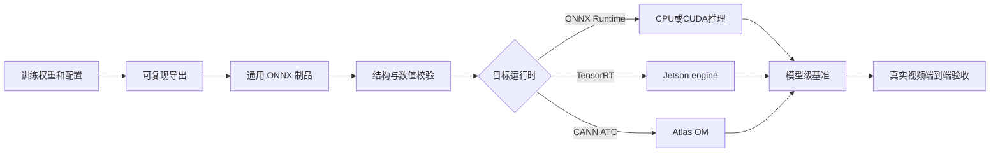

# 边缘推理与 ONNX 部署规范

> 版本：0.2.0  
> 更新日期：2026-09-16  
> 适用范围：车辆检测、车牌检测、PaddleOCR、交通流预测，以及 Jetson、Atlas 等边缘设备部署  
> 资料来源：《边缘部署优化_ONNX与轻量级部署20260903.pptx》与项目当前实现

## 1. 文档目的

本文档统一项目的 ONNX 制品、量化、目标设备适配、性能测试和验收口径。后续开发应以项目代码、实际模型产物和可复现实验记录为事实来源。课件中的代码、性能表和验收数字用于说明方法，不代表项目已经达到相同结果。

边缘部署的完成状态分为四级：

| 状态 | 含义 |
| --- | --- |
| 已实现 | 仓库中已有代码或模型产物 |
| 已验证 | 已在明确记录的环境中执行并通过检查 |
| 已有入口 | 已提供参数或脚本，但目标路径尚未完成真实运行验收 |
| 未实现 | 仓库中没有对应产物或可执行闭环 |

文档和汇报必须使用这些状态，不得把“已有导出入口”描述成“边缘设备部署完成”。

## 2. 当前项目基线

截至 2026-09-16，项目的实际状态如下。

| 链路 | 当前实现 | 状态与边界 |
| --- | --- | --- |
| 车辆检测 | `yolov8n.pt`，并有 `yolov8n.onnx` | ONNX 为 opset 18、FP32、约 12.68 MB，无量化节点；已通过 `onnx.checker` 和 ONNX Runtime CPU 加载。默认配置仍使用 `.pt` |
| 车牌检测 | `models/exp-7.pt`，并有 `models/exp-7.onnx` | ONNX 为 opset 18、FP32、约 9.62 MB，无量化节点；已通过 `onnx.checker` 和 ONNX Runtime CPU 加载。默认配置仍使用 `.pt` |
| OCR | PaddleOCR/PaddleX，项目缓存 `PP-OCRv6_medium_det` 与 `PP-OCRv6_medium_rec` | OCR 未转换为本项目 ONNX 制品，不能用检测模型的 ONNX 结论覆盖 OCR |
| 交通流预测 | `backend/prediction/` 下的 ONNX 模型与 `PredictionService` | 已具备 metadata 校验、Session 复用、图优化、预热、FastAPI 健康检查和 CPU 推理。默认运行链启用中国收费站研究候选，不代表现场生产模型 |
| YOLO 导出 | `edge/export_models.py` | 已有 ONNX、TensorRT、FP16、INT8 参数入口；非法组合、设备、校准参数和产物扩展名已由单元测试覆盖，FP16/INT8/engine 的真实导出仍需目标环境验证 |
| ONNX 制品校验 | `edge/validate_artifacts.py` | 已实现 checker、opset、I/O、SHA-256、量化节点、Provider 加载与回退检查，并生成 manifest 和 JSON 报告；三份当前 ONNX 已通过 CPU 校验 |
| 模型级基准 | `edge/benchmark.py` | 已实现预热、动态 shape、Provider 核验、avg/p50/p95/FPS、环境和 RSS 快照；当前仅完成本机 CPU 随机输入基线 |
| 导出行为对比 | `edge/compare_models.py` | 已实现 `.pt` 与 `.onnx/.engine` 后 NMS 检测匹配、门槛和 JSON 报告；车辆与车牌 FP32 ONNX 已完成真实图片样本对比 |
| Jetson TensorRT | 无 `.engine` 产物和实机基准报告 | 已有入口，未完成目标设备验收 |
| Atlas CANN | 无 `.om`、ATC 构建脚本、ACL 推理封装和实机报告 | 未实现，仅保留为可选适配方向 |

当前两份感知 ONNX 和默认中国交通流 LSTM ONNX 均为 FP32，文件大小也没有证明其小于对应 PyTorch 权重。因此项目不能宣称已经实现模型压缩、INT8 量化或边缘端 3 至 4 倍加速。

## 3. 推理链路与职责边界

项目包含三条性质不同的模型链路。

感知链路负责车辆检测和车牌检测，当前由 Ultralytics `YOLO` 统一加载 `.pt`、`.onnx` 或 `.engine`。LPR 后处理继续包含车牌 ROI 裁剪、透视校正、图像增强、PaddleOCR 和车牌格式校验。

预测链路负责交通流时序预测，由 `PredictionService` 加载 ONNX，并根据同名 JSON metadata 校验历史长度、采样粒度、特征顺序、目标列和输出维度。

OCR 链路当前使用 PaddleOCR/PaddleX 离线模型。未来若单独转换或替换 OCR 运行时，必须建立独立的精度和性能报告，不能沿用 YOLO 的验收结果。

## 4. 模型制品契约

每个可交付模型应包含源权重、通用 ONNX、导出脚本、metadata、校验结果和基准报告。TensorRT `.engine` 与 Atlas `.om` 属于设备相关派生制品，需要绑定目标硬件和运行时版本，不能作为跨设备通用文件。

metadata 或相邻 manifest 至少记录以下信息：

- 模型用途、来源权重及 SHA-256。
- PyTorch、Ultralytics、ONNX、ONNX Runtime、TensorRT 或 CANN 版本。
- opset、输入输出名称、数据类型、固定维度和动态维度。
- 图像颜色顺序、letterbox 规则、填充值、归一化参数和 NCHW/NHWC 布局。
- 置信度阈值、NMS IoU 阈值、类别映射和坐标恢复规则。
- 量化方式、校准数据版本、精度回归结果和目标设备。
- 导出命令、执行时间、设备信息和生成文件哈希。

课件使用的 `opset=12` 是示例值。项目应根据 PyTorch、Ultralytics、ONNX Runtime、TensorRT 或 CANN 的实际兼容矩阵选择 opset。现有感知 ONNX 为 opset 18，预测模型也可能使用不同 opset，不能为了形式一致强制降级。

## 5. 输入输出与预处理契约

预处理必须只有一个责任方。缩放、颜色转换、归一化等操作可以由应用代码、ONNX 图或 Atlas AIPP 承担，但不能重复执行。每次部署都要明确以下契约：

- 输入是 BGR 还是 RGB，数据类型是 `uint8`、FP32、FP16 还是 INT8。
- 输入形状是否固定为 `1x3x640x640`，哪些维度允许动态变化。
- letterbox 的缩放比例、填充值和对齐方式。
- 归一化公式及其所在层次。
- 输出张量的语义、框格式、类别索引和 NMS 所在层次。
- 检测框从模型输入坐标恢复到原始视频帧坐标的方法。

动态 batch 或动态图像尺寸会增加 TensorRT profile 和设备内存规划的复杂度。实时视频通常优先验证 `batch=1` 和固定输入尺寸。批量离线任务再单独评估动态 batch 或 `batch=8/16` 的吞吐收益。

## 6. 导出与验证流程

标准流程依次完成源模型基线、ONNX 导出、结构检查、数值一致性、真实数据精度和目标设备性能验证。

1. 固定源权重、软件版本、测试数据和随机种子，先记录 PyTorch 基线。
2. 导出 ONNX，并保留完整命令、日志和哈希。
3. 使用 `onnx.checker.check_model()` 检查结构。
4. 使用 ONNX Runtime 加载模型，确认实际 Execution Provider、输入输出名称和维度。
5. 对相同输入比较 PyTorch 与 ONNX 原始张量。课件的 `< 1e-5` 可作为 FP32 数值检查参考，但检测模型还要处理 NMS 排序和浮点边界差异。
6. 在固定真实交通验证集上比较框数量、类别、置信度、IoU、mAP 和车牌识别指标。
7. 量化或生成设备制品后重复精度和性能测试。
8. 最后运行完整视频链路，包含解码、预处理、车辆检测、车牌检测、透视校正、OCR、后处理和事件输出。

ONNX 图简化属于可选步骤。简化前后都要通过 checker 和数值校验，不能因为工具返回成功就跳过回归测试。

项目当前提供三类可重复执行的验证入口：

- `python -m edge.validate_artifacts ... --require-provider` 校验结构、opset、I/O、哈希、量化节点和实际 Provider，可写出 manifest 与 JSON 报告。
- `python -m edge.benchmark ... --warmup 10 --iterations 100` 执行模型级随机输入基准，`cpu/cuda/tensorrt` 别名会展开为 ONNX Runtime Provider，Provider 不可用或主 Provider 回退时直接失败。
- `python -m edge.compare_models ... --imgsz ...` 比较两个 Ultralytics 后端的后 NMS 检测结果，可用匹配率、平均 IoU 和置信度差门槛阻止不一致制品进入交付链。

这些工具解决结构、运行时、模型执行性能和样本级输出一致性问题。它们不替代人工标注验证集的 mAP/召回率，也不替代包含 OCR 和事件处理的端到端验收。

## 7. FP16 与 INT8 策略

FP32 是所有优化的基线。Jetson 路线优先建立 FP16 基线，因为 TensorRT 对 FP16 的支持更成熟，通常也比 INT8 更容易保持精度。只有 FP16 已通过完整链路验收后，才进入 INT8 校准与评估。

INT8 必须使用代表性交通图像。校准集至少覆盖白天、夜间、逆光、雨雾、运动模糊、小目标、不同曝光和常见车辆尺度。校准数据、验证数据和训练数据要明确区分，并保存版本或哈希。

课件同时出现 ONNX Runtime `quantize_dynamic()` 和“INT8 需要校准数据”两种表述。对于卷积检测模型，动态权重量化、静态校准量化、TensorRT INT8 和 CANN INT8 是不同技术路径，不能混为同一结果。项目必须在目标设备上逐条验证，不采用“边缘设备统一使用 INT8”的无条件规则。

量化验收需要明确精度损失的定义。`mAP 损失 < 1%` 必须说明是相对下降小于 1%，还是 mAP 绝对值下降小于 0.01，并补充车牌召回率、字符准确率、整牌准确率和非法格式误判率。

## 8. 目标设备路线

### 8.1 Jetson

Jetson 路线使用 JetPack、CUDA 和 TensorRT。TensorRT engine 应在目标设备或与目标设备、TensorRT 版本严格兼容的环境中构建。构建过程需要检查 ONNX parser 错误、设置固定或动态 shape profile、记录 workspace 与精度模式，并验证序列化和重新加载。

部署报告至少记录 Jetson 型号、JetPack、CUDA、cuDNN、TensorRT、功耗模式、时钟状态、温度、内存峰值和是否发生降频。当前仓库没有可验收的 `.engine`，因此 Jetson 仍处于待实机验证状态。

### 8.2 Atlas

Atlas 路线需要锁定具体 SoC、CANN/ATC 版本和算子支持范围，再将 ONNX 转换为 `.om`。AIPP 配置承担图像预处理时，应用层不得再次执行相同归一化。ACL 推理封装还需要处理资源初始化、设备内存、输入输出数据集和异常释放。

当前仓库没有 Atlas 构建脚本、`.om` 制品或 ACL 推理实现。Atlas 是后续国产化适配方向，不属于已完成能力。

## 9. 性能基准规范

课件建议预热 10 次、正式执行 100 次，并分别测试 `batch=1` 延迟和 `batch=8/16` 吞吐。项目采用该方法作为最低起点，同时补充以下规则：

- 使用高精度单调计时器，报告平均值、p50、p95、最小值、最大值和 FPS。
- 同时记录模型执行延迟和端到端延迟，两个口径不能混写。
- 随机张量只用于内核基准，真实图像用于完整性能和精度验收。
- 明确同步 GPU 或设备队列，避免只测到异步提交时间。
- 记录实际启用的 Execution Provider，禁止 CUDA/TensorRT 不可用后静默回退 CPU 而仍沿用原报告标签。
- 记录硬件、操作系统、驱动、运行时、线程数、功耗模式、温度、内存峰值和持续运行时长。
- 对视频流记录解码、预处理、车辆检测、车牌检测、OCR、后处理和事件发送的分段耗时。

课件第 7 页的 12.4 MB、18.2 ms、55 FPS 等数据缺少设备、软件版本和数据集，只能作为教学示例。`ONNX FP32 快 25%` 使用的是 FPS 增长口径，不能直接替换成延迟下降口径。

### 9.1 当前 CPU 模型级基线

2026-09-16 在 Windows 11、ONNX Runtime 1.29.0、`CPUExecutionProvider`、16 个物理核心和 24 个逻辑核心环境中，使用固定随机种子、`batch=1`、10 次预热和 100 次正式执行得到以下基线：

| 模型 | 输入 | avg | p50 | p95 | 模型级 FPS |
| --- | --- | ---: | ---: | ---: | ---: |
| `yolov8n.onnx` | `1x3x640x640` | 20.098 ms | 20.045 ms | 21.351 ms | 49.756 |
| `models/exp-7.onnx` | `1x3x640x640` | 15.114 ms | 15.052 ms | 16.808 ms | 66.165 |
| 中国交通流 LSTM ONNX | `1x6x6` | 0.059 ms | 0.056 ms | 0.092 ms | 16843.807 次/s |

车辆模型在 1 张真实违章图上得到 10 个参考框，ONNX 匹配 10/10，平均 IoU 为 0.999998951。车牌模型使用 184 张现有违章图和 `imgsz=1280`；103 张图存在参考检测，121 个参考框与 ONNX 121/121 匹配，平均 IoU 为 0.999999516。由于这些图片没有人工检测标注，结果仅证明 `.pt` 与 `.onnx` 行为一致，不能解释为检测准确率。

完整报告和解释限制见 [`edge/reports/README.md`](../../edge/reports/README.md)。以上数据只测同步模型调用，不包含预处理、NMS、OCR、视频解码、温度和功耗，不能与课件示例或目标边缘设备结果直接比较。

## 10. 验收门槛

课件提出 ONNX checker 通过、FP32 输出误差 `< 1e-5`、INT8 mAP 损失 `< 1%`、相对 PyTorch 提速 `>= 25%`、目标设备 FPS `>= 15`。这些数值保留为课程验收参考，只有在明确硬件、数据集、测量范围和计算公式后，才能转为项目门槛。

项目的正式验收包含六组检查：

| 检查组 | 必须满足的条件 |
| --- | --- |
| 结构 | ONNX checker 通过，运行时可加载，输入输出契约与 metadata 一致 |
| 数值 | 源模型与导出模型在固定输入上完成张量对比，差异有明确阈值和解释 |
| 业务精度 | 车辆和车牌检测、OCR、整牌识别及关键场景子集均无不可接受回退 |
| 性能 | 报告 avg/p50/p95/FPS、内存、温度和功耗，并区分模型级与端到端口径 |
| 设备 | 目标设备连续运行通过，不发生静默 Provider 回退、显存泄漏或热降频失控 |
| 可复现 | 模型、脚本、配置、版本、数据摘要、日志和哈希齐全，可重新构建制品 |

`FPS >= 15` 对应单帧约 66.7 ms，但必须先说明这是单模型还是车辆检测到 OCR 的完整流水线。项目尚未确定正式边缘设备和摄像头并发规模，因此当前不把该数字写成生产 SLA。

## 11. 项目措辞红线

后续文档、答辩材料和代码注释遵守以下边界：

- ONNX 文件存在，只能说明完成了格式导出，不能说明模型已经压缩或加速。
- `edge/export_models.py` 有 TensorRT、FP16、INT8 参数，只能说明有实现入口，不能说明这些路径已在实机运行。
- 没有 `.engine`、`.om` 和目标设备报告时，不能写“Jetson/Atlas 部署完成”。
- 课件的速度、体积和 mAP 表格不能作为本项目实测结果。
- 车辆检测、车牌检测、OCR 和交通流预测必须分别记录模型状态，不能用其中一条链路代表全部模型。
- 中国收费站 LSTM 是研究/实训候选，不能称为项目现场生产模型。
- 任何性能结论必须附带硬件、软件版本、测试数据、计时范围和样本数量。

## 12. 当前待办顺序

1. 锁定目标 Jetson 型号及 JetPack、CUDA、TensorRT 版本，实测 `edge/export_models.py` 的 FP16、INT8 和 engine 路径，并保存设备绑定的构建 manifest。
2. 准备有授权、带人工标注的独立验证集和代表性校准集，建立车辆检测、车牌检测、OCR 与整牌识别基线；现有行为一致性报告不能替代业务精度。
3. 增加真实视频端到端 benchmark，将解码、预处理、车辆检测、车牌检测、透视矫正、OCR、后处理和事件发送分段计时，并输出 JSON/CSV。
4. 在 Jetson 上生成 FP16 基线和 INT8 候选，完成 p50/p95、峰值内存、功耗、温度、热稳定性、异常恢复和长时间运行验收。
5. 将 manifest 校验和固定样本行为对比接入 CI；GPU 与设备测试保留在具备对应运行时的专用执行器上，避免 CPU 环境伪装通过。
6. 只有国产化目标、Atlas SoC 和 CANN 版本明确后再实现 ATC/AIPP/ACL 闭环，避免维护无法验证的 `.om` 路径。
