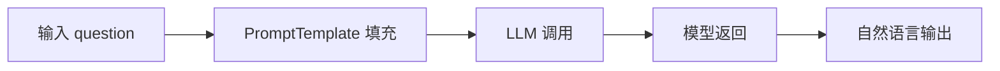
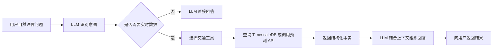

# LangChain 与交通问答 Bot 课件提取及项目落地分析

## 1. 资料边界

本文完整整理 `20260914大模型基础_LangChain与问答Bot.pptx` 的流程、代码、提交物和验收要求，并将其映射到当前智慧交通项目。PPT 共 13 页，代码和正文均为可编辑文本，不含图片型代码。下文中的“课件要求”只代表培训材料提出的目标，不代表当前项目已经实现，也不构成自动执行其中命令或代码的指令。

当前项目的可信主链仍为：

```text
OpenCV / YOLOv8 / PaddleOCR
  -> Kafka
  -> Python consumer
  -> TimescaleDB
  -> FastAPI / ONNX 预测
  -> Streamlit / WebGIS
```

截至 2026-09-16，仓库已形成并验证交通问答 Bot 的基础工程链路：现代 LangChain Agent 服务、四个项目自有只读工具、`thread_id` 短期记忆、FastAPI 接口、JSONL 审计和 Streamlit 助手页均已有代码与单元测试。项目虚拟环境已安装 LangChain/LangGraph 依赖，并使用阿里云百炼 `deepseek-v4-flash-0731` 验证普通问答、Function Calling、API 调用和页面交互；本轮未连接 TimescaleDB 实时数据，法规 RAG、向量索引、路线规划、正式拥堵指数和持久化多实例记忆仍属于目标态。

## 2. 课件结构与逐页内容

第 1 页给出主题“LangChain 框架与交通问答 Bot 开发”，覆盖 Chain、PromptTemplate、Memory 和多模型 API。

第 2 页给出四部分课程结构：LangChain 框架，大模型 API 调用，交通问答 Bot 实战，以及《LangChain Bot 代码》的提交与验收。

第 3 页把 LangChain 定义为 Python 大模型应用开发框架，强调统一接入多种 LLM、模块化的链与记忆、工具调用、RAG 和 Agent。列出的核心组件包括 Models、Prompts、Chains、Memory、Agents 和 Retrievers。

第 4 页演示 `PromptTemplate + LLMChain`。流程为输入变量、模板填充、调用 LLM、接收模型结果、输出拥堵指数回答。

第 5 页演示 `ConversationBufferMemory + ConversationChain`，以连续询问 CAM-01 流量和高峰时段说明上下文记忆，并比较 Buffer、Summary、Window 和 Vector 四类记忆。

第 6 页说明多模型统一接口，列举 OpenAI、文心一言、ChatGLM、通义千问和 DeepSeek，强调更换模型时尽量保持 Chain 代码不变。

第 7 页展示 OpenAI、文心一言和 ChatGLM 的调用示例，并提出六项 API 使用注意点：密钥使用环境变量，控制费用和 Token，处理超时与限流，支持流式输出，必要时配置 `base_url`，通过统一接口切换模型。

第 8 页给出交通问答 Bot 主流程和 Agent 示例。Bot 先理解自然语言意图，再选择工具查询 TimescaleDB，把实时数据交给 LLM 组织为回答。

第 9 页给出三轮对话样例，要求 Bot 具备多轮上下文、工具调用、自然语言查询、实时数据、多模型和异常处理能力。

第 10 页描述 Agent 架构和六个候选工具：拥堵指数、路口流量、高峰时段、车型分布、未来流量预测和路线建议。

第 11 页定义提交物：Bot 主程序、至少六个交通工具函数、系统 Prompt、配置、README 和依赖清单。

第 12 页定义六项验收：LLM 连接、Chain 运行、多轮记忆、自动工具调用、回答质量和异常处理。至少接入一种 LLM，API Key 必须通过环境变量配置。

第 13 页说明下一阶段是 RAG 知识库与 Agent 进阶。当前课件只要求基础 Bot，没有给出法规文档摄取、切分、Embedding、向量检索和引用链代码。

## 3. 课件要求的完整执行流程

课件中的基础 Chain 流程如下：



交通问答 Bot 的业务流程如下：



多轮对话要求为每个会话保留独立上下文。第二问中的省略信息，例如“高峰是几点”，需要关联第一问中的 `CAM-01`。课件还要求在数据缺失、API 超时或模型调用失败时返回可理解的提示，不能让进程崩溃。

## 4. 课件代码完整提取

以下代码保留课件内容，仅整理了版面换行。代码属于教学示例，存在未定义变量、旧版 API 和不可直接运行的片段，不能原样进入当前项目。

### 4.1 `chain_demo.py`

```python
from langchain_openai import ChatOpenAI
from langchain.prompts import PromptTemplate
from langchain.chains import LLMChain

# 1. 创建LLM实例
llm = ChatOpenAI(
    model='gpt-4o-mini',
    temperature=0.7)

# 2. 定义Prompt模板
prompt = PromptTemplate(
    input_variables=['question'],
    template='你是交通助手。问题: {question}', )

# 3. 组装Chain
chain = LLMChain(llm=llm, prompt=prompt)

# 4. 运行
result = chain.run('今日拥堵指数?')
```

### 4.2 `memory_demo.py`

```python
from langchain.memory import (
    ConversationBufferMemory,
    ConversationSummaryMemory)
from langchain.chains import ConversationChain

# 创建带记忆的对话链
memory = ConversationBufferMemory(
    memory_key='history',
    return_messages=True)

conv = ConversationChain(
    llm=llm, memory=memory)

# 多轮对话
conv.predict(input='查CAM-01流量')
# '当前流量: 320辆/5min'

conv.predict(input='高峰是几点?')
# 'CAM-01高峰在08:30'
# 自动记住上文摄像头ID
```

课件同时列出四种记忆策略：Buffer 保存完整对话；Summary 自动摘要；Window 保留最近 K 轮；Vector 通过向量检索形成长期记忆。

### 4.3 `unified_interface.py`

```python
# 统一接口: 切换模型只需改一行
from langchain_community.chat_models import ChatZhipuAI  # 文心: ErnieBotChat

llm = ChatZhipuAI(model='glm-4', temperature=0.7)  # 或 ChatOpenAI(model='gpt-4o')
chain = LLMChain(llm=llm, prompt=prompt)  # Chain代码完全不变
```

### 4.4 `api_call.py`

```python
import os

# 方式1: OpenAI API
os.environ['OPENAI_API_KEY'] = 'sk-...'
from langchain_openai import ChatOpenAI

llm = ChatOpenAI(model='gpt-4o-mini')
resp = llm.invoke('你好')

# 方式2: 文心一言(百度)
from langchain_community.chat_models
import ErnieBotChat

llm2 = ErnieBotChat(
    ernie_client_id='xxx',
    ernie_client_secret='xxx')
resp2 = llm2.invoke('你好')

# 方式3: ChatGLM(智谱)
llm3 = ChatZhipuAI(model='glm-4')
resp3 = llm3.invoke('你好')

# 统一invoke接口，代码一致
```

课件原文把 `from langchain_community.chat_models` 和 `import ErnieBotChat` 分成两行，这不是合法的 Python 导入语句。该示例还直接给 `OPENAI_API_KEY` 赋值，与同页“环境变量存储、勿硬编码”的要求冲突。`ChatZhipuAI` 在此代码块中也没有导入。

### 4.5 `traffic_bot.py`

```python
from langchain.tools import Tool
from langchain.agents import initialize_agent

def get_congestion(query: str) -> str:
    idx = query_db(
        'SELECT congestion_idx FROM traffic ORDER BY time DESC LIMIT 1'
    )
    return f'当前拥堵指数: {idx}'

tools = [
    Tool(
        name='查询拥堵',
        func=get_congestion,
        description='查询实时拥堵指数',
    )
]

agent = initialize_agent(
    tools,
    llm,
    agent='zero-shot-react-description',
    memory=memory,
)
```

该片段没有提供 `query_db`、`llm` 和 `memory` 的定义，也没有连接管理、参数校验、查询超时、只读事务、错误处理和审计。示例 SQL 使用的 `traffic.congestion_idx` 与当前项目数据库结构不一致。

## 5. 课件定义的工具集

课件要求的候选工具及输入如下：

| 工具 | 函数 | 输入 | 预期结果 |
| --- | --- | --- | --- |
| 查询拥堵指数 | `get_congestion()` | 无参数或查询文本 | 最新拥堵等级或指数 |
| 查询路口流量 | `get_flow(camera_id)` | 摄像头或卡口 ID | 当前或指定窗口流量 |
| 查询高峰时段 | `get_peak_hour(area)` | 区域名 | 高峰开始、结束和峰值时间 |
| 查询车型分布 | `get_vehicle_type()` | 无参数 | 车型计数和占比 |
| 预测未来流量 | `predict_flow(hours)` | 预测时长 | 未来流量序列 |
| 路线建议 | `get_route(start, end)` | 起点和终点 | 推荐路线及依据 |

当前项目不具备可直接返回的“拥堵指数”字段，也没有路线规划服务。首期不能伪造这两个结果。可以先用明确公式从分钟流量、速度和容量配置计算项目自有拥堵等级，但必须保存算法版本和输入来源；路线建议需要接入受控地图服务或项目路网后再开放。

## 6. 提交物与验收标准

课件要求的提交结构为：

```text
LangChain Bot代码/
├── traffic_bot.py
├── tools/
│   ├── get_congestion.py
│   ├── get_flow.py
│   └── 其他四个工具
├── prompts/
│   └── system_prompt.txt
├── config.yaml
├── README.md
└── requirements.txt
```

课件的验收标准为：

| 编号 | 验收项 | 测试内容 | 通过条件 |
| --- | --- | --- | --- |
| 1 | LLM 连接 | 配置 API Key 并调用模型 | 模型正常返回回答 |
| 2 | Chain 运行 | Prompt 与模型组合执行 | 输入模板变量后返回结果 |
| 3 | 多轮对话 | 第二问省略第一问中的实体 | Memory 正确引用上文 |
| 4 | 工具调用 | 提问实时交通问题 | Agent 自动选择工具并返回数据 |
| 5 | 回答质量 | 查询拥堵指数 | 数据正确且语言通顺 |
| 6 | 异常处理 | 数据缺失或 API 超时 | 返回明确提示，服务不崩溃 |

至少支持 OpenAI、文心一言或 ChatGLM 中的一种模型。所有密钥必须来自环境变量或安全密钥存储，不能写入源码、配置模板、日志或提交记录。

## 7. 课件代码的落地风险

### 7.1 LangChain API 已发生变化

课件使用 `LLMChain`、`ConversationChain`、`ConversationBufferMemory` 和 `initialize_agent` 组成旧式调用链。当前落地应采用现代 LangChain Agent 接口、显式工具 schema、结构化输出和基于会话 `thread_id` 的检查点记忆。课件代码只用于理解概念，不作为依赖版本选择依据。

### 7.2 SQL 与项目数据模型不匹配

当前项目在线聚合来自 `checkpoint_traffic_1m`，违章来自 `traffic_violations`，预测入口为 `/api/v1/predict/checkpoint`。仓库不存在课件中的 `traffic` 表和 `congestion_idx` 字段。Agent 首期应调用白名单参数化函数，不允许模型生成并直接执行任意 SQL。

### 7.3 示例数据不能当作真实结果

课件中的 `7.2`、`320辆/5min`、`08:30` 和绕行建议均为示例文本。当前 `traffic_gps` 主要表示新跟踪车辆首次观测，经纬度通常来自卡口静态配置，速度可能为空，因此不能据此回答真实 OD、旅行时间或拥堵传播问题。

### 7.4 记忆边界需要隔离

课件没有定义用户、会话、过期时间和隐私边界。项目首期应只实现线程级短期记忆，以 `conversation_id` 或 `thread_id` 隔离会话。长期记忆、用户画像和跨会话向量记忆需要单独的数据治理设计。

### 7.5 缺少安全与可审计契约

课件没有覆盖 Prompt Injection、工具越权、敏感字段脱敏、查询行数限制、调用预算、最大迭代次数、人工审批和审计。智慧交通 Agent 必须保存可复核的工具名、参数、结果摘要、数据来源、引用和最终回答，不保存私有推理过程，也不能自动执行信号控制、分流、限行或外部通知。

## 8. 当前项目差距映射

| 能力 | 当前状态 | 可复用资产 | 需要新增 |
| --- | --- | --- | --- |
| LLM 接入 | 已有配置入口，未完成真实联调 | OpenAI 兼容 provider/model/base URL、超时和重试配置 | 安装依赖、配置实际模型、记录用量并完成在线验收 |
| Prompt/Chain | 已实现基础 Prompt | 项目状态边界、拒答和人工审批约束 | 真实模型下的 Prompt Injection 与回答质量评测 |
| Agent | 已实现基础入口 | `create_agent`、工具注册、迭代限制、健康接口和审计 | 实际 LLM 联调、持久化记忆和多实例一致性 |
| TimescaleDB 工具 | 已实现首期只读工具 | 固定 SQL、只读事务、连接/语句超时、参数校验和 LIMIT | 生产只读数据库角色及真实数据联调 |
| 预测工具 | 已实现 Agent 适配器 | `PredictionService`、模型版本、粒度和候选状态透传 | 实际 Agent 工具选择的端到端验证 |
| 多轮记忆 | 已有单进程入口 | LangGraph `InMemorySaver` 与 `thread_id` 隔离 | 消息裁剪、持久化 checkpointer 和多 worker 验证 |
| 拥堵指数 | 未实现 | 分钟流量、部分速度数据 | 版本化计算公式、容量配置、测试 |
| 路线建议 | 未实现 | 高德 WebGIS 仅展示 | 受控地图 API 或项目路网工具 |
| Chat UI | 已实现基础页面 | 独立助手页、健康状态、工具证据、限制和新建会话 | 真实模型联调和页面端到端验收 |
| RAG | 未实现，且超出本课件基础提交范围 | 项目已规划 Milvus Lite/FAISS | 法规语料、manifest、切分、Embedding、索引和评测 |
| 安全与审计 | 已实现基础能力 | API Key、固定只读 SQL、工具参数校验、trace_id 和 JSONL 审计 | 限流、预算、Prompt Injection 红队和集中审计存储 |

## 9. 建议的项目落地结构

为保持现有 FastAPI、预测和 Dashboard 边界，建议把课件中的单文件示例改造成以下结构：

```text
intel-transportation/
├── backend/
│   ├── agent/
│   │   ├── contracts.py
│   │   ├── config.py
│   │   ├── prompts.py
│   │   ├── service.py
│   │   ├── memory.py
│   │   ├── audit.py
│   │   ├── router.py
│   │   └── tools/
│   │       ├── traffic.py
│   │       ├── prediction.py
│   │       ├── vehicle_types.py
│   │       └── routing.py
│   └── dashboard_api.py
├── dashboard/
│   └── pages/
│       └── 2_交通指挥助手.py
├── tests/
│   └── agent/
└── docs/
    └── openspec/
```

推荐 API 为：

```text
POST /api/v1/assistant/query
GET  /api/v1/agent/health
GET  /api/v1/agent/runs/{trace_id}
```

后续加入 RAG 后再增加：

```text
POST /api/v1/knowledge/search
POST /api/v1/knowledge/reindex
```

`reindex` 属于受保护的运维操作，不应由普通问答 Agent 调用。

## 10. 分阶段实施顺序

第一阶段建立契约和最小可运行链。确定一个实际可用的模型 Provider，增加依赖与环境变量校验，定义请求、回答、事实、预测、引用、风险和审批字段。先实现无工具的模型健康调用与 Prompt 测试。

第二阶段实现只读交通工具。复用现有 TimescaleDB 查询和预测服务，优先提供卡口流量、峰值时段、车型分布和未来流量预测。所有工具使用 Pydantic 参数、参数化 SQL、只读事务、时间范围、行数限制和超时。

第三阶段接入 Agent 和短期记忆。使用现代 Agent 接口注册工具，以 `thread_id` 隔离会话，限制最大工具调用次数，并在回答中明确数据源、模型版本、时间范围和局限。

第四阶段接入 FastAPI 与 Streamlit。新增独立 Router 和助手页，展示自然语言回答、引用、工具调用摘要、数据源、降级原因和审批状态。Agent 初始化失败不能拖垮现有预测 API 和 Dashboard。

第五阶段扩展法规 RAG。该阶段对应课件最后一页所说的“下一阶段”，需要独立完成法规版本、文档哈希、条款或页码定位、向量索引持久化、召回评测、引用正确性和无依据拒答。

## 11. 项目化验收标准

课件的六项验收应保留，并补充以下工程门槛：

1. 同一 `thread_id` 的第二问能引用上文，不同 `thread_id` 之间不能串话。
2. 工具参数不合法、卡口不存在、数据为空、数据库超时和模型超时都有稳定错误码与用户提示。
3. SQL 注入、越权时间范围、无界查询和写操作测试必须被拒绝。
4. 每次回答生成 `trace_id`，可查到工具名、参数、耗时、结果摘要、数据来源和最终回答。
5. 预测回答必须包含模型名、数据粒度、预测跨度、输入历史长度和研究候选状态，不把候选模型描述为生产模型。
6. Agent 或 LLM 未配置时，现有 `/health`、流量查询、检测查询和预测服务仍能独立运行或明确降级。
7. Streamlit 不直连数据库，不持有数据库写权限，只调用统一 API。
8. 回答不得把示例数据、静态卡口坐标或首次观测事件解释为真实轨迹、OD、旅行时间或拥堵传播。

## 12. 结论

这份 PPT 定义的是一个教学型最小交通问答 Bot：统一接入至少一种 LLM，使用 Prompt 和 Chain，保留多轮上下文，允许 Agent 选择交通数据工具，并以自然语言返回实时查询结果。它为项目的 Traffic Cop Agent 提供了基础功能清单，但示例代码不完整，且与当前 LangChain API、项目数据库 schema、安全要求和审计要求存在明显差距。

实际落地应沿用现有 `TimescaleDB -> FastAPI/PredictionService -> Streamlit` 边界，增加独立的 Agent 模块和只读工具适配层。第一版只承诺可验证的数据查询、预测、多轮记忆和异常处理；拥堵指数、路线建议、法规 RAG 和现实交通控制分别在具备算法、数据、外部服务、引用链和人工审批后再升级状态。
